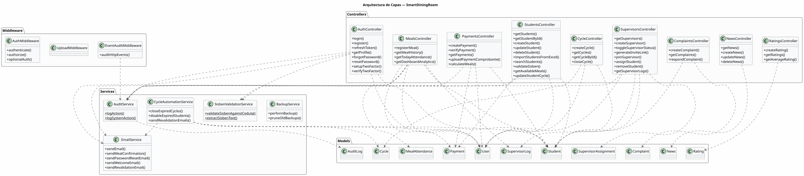
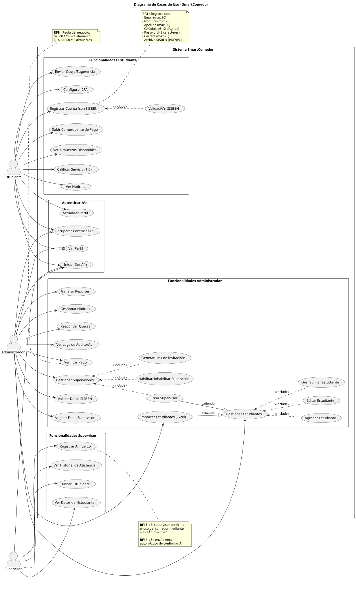
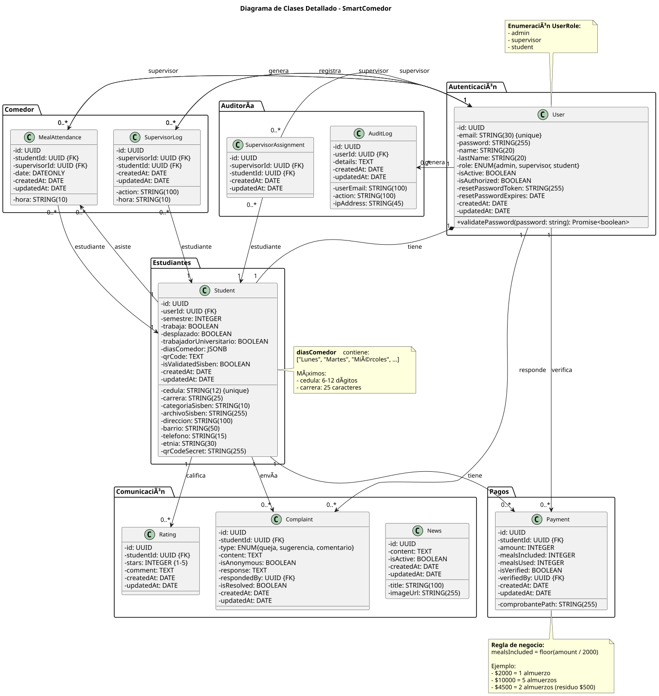
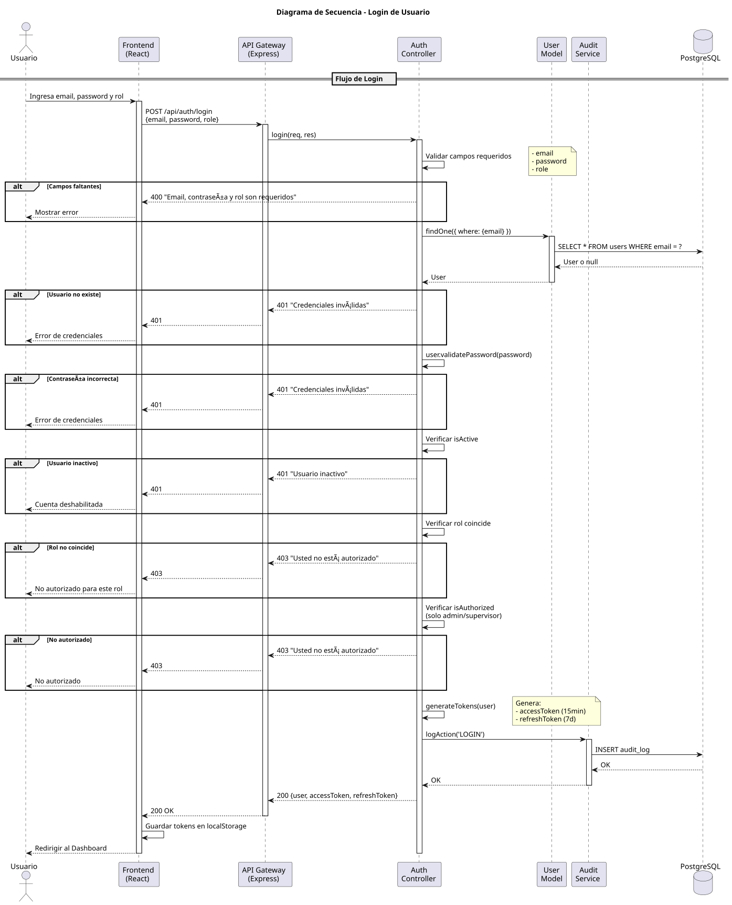
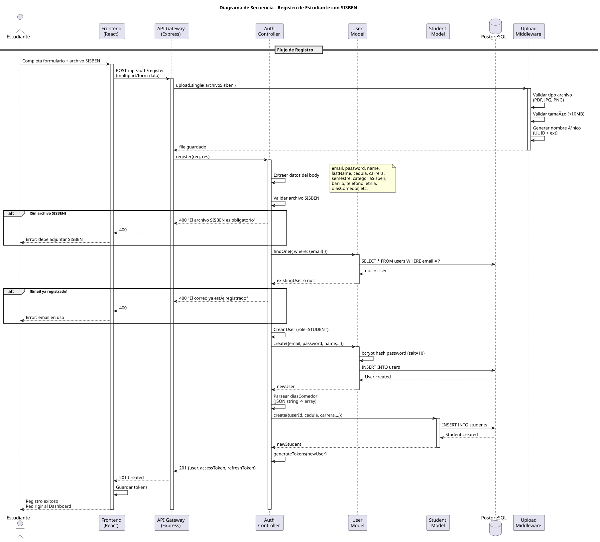
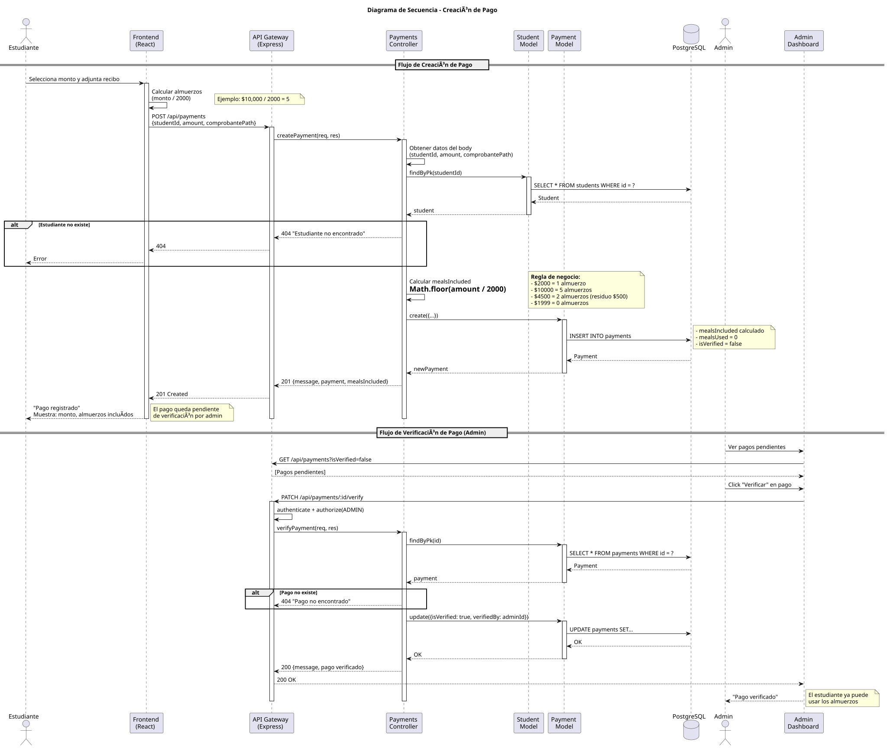
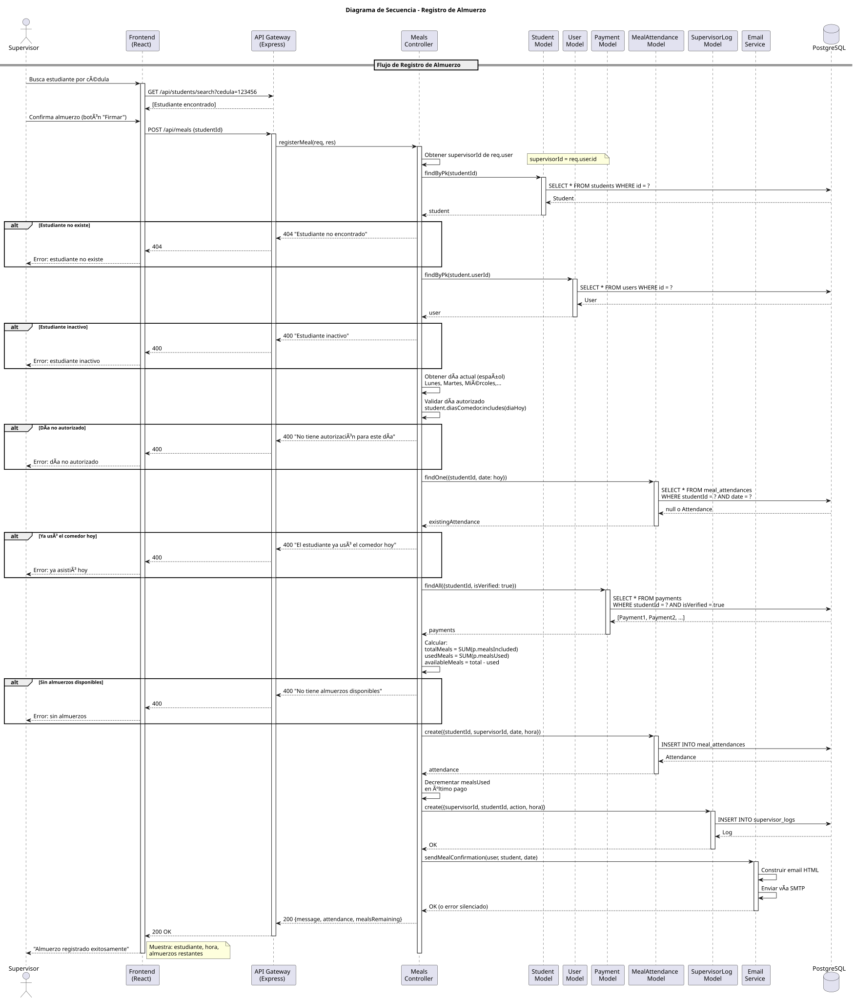
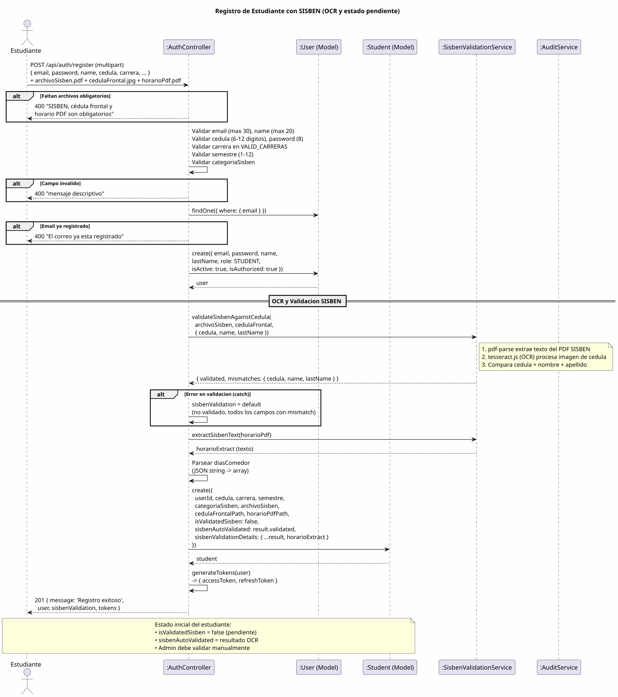
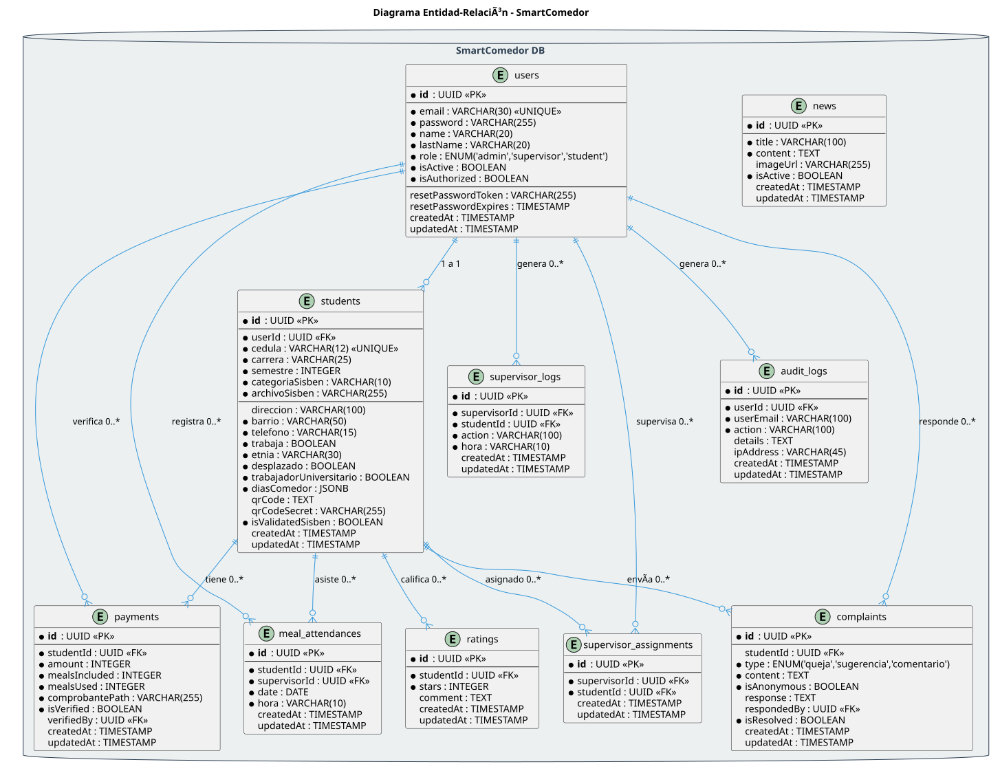
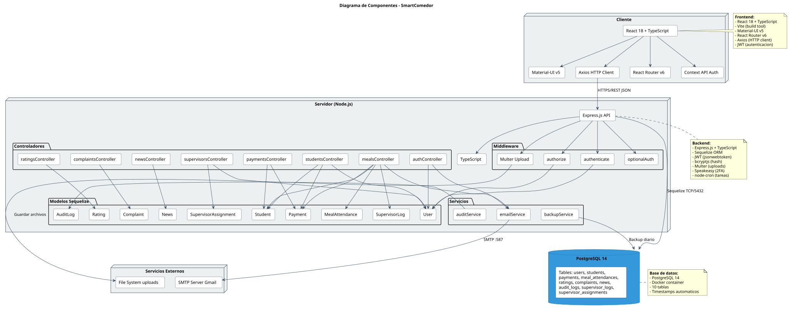

# SmartComedor — Documentación Técnica

## PRIMERA PARTE: Descripción del Sistema

> Sistema de Gestión del Comedor Universitario (SmartComedor / SmartDiningRoom)
>
> Documento técnico de ingeniería de software — Análisis, requerimientos, diseño y producto.

---

## Tabla de contenido

1. [Descripción del sistema](#1-descripción-del-sistema)
   1. [Identificación del problema](#11-identificación-del-problema)
   2. [Descripción detallada del sistema o aplicación](#12-descripción-detallada-del-sistema-o-aplicación)
2. [Modelo de requerimientos](#2-modelo-de-requerimientos)
   1. [Descripción](#21-descripción)
   2. [Requisitos funcionales](#22-requisitos-funcionales)
   3. [Requisitos no funcionales](#23-requisitos-no-funcionales)
3. [Modelo de casos de uso](#3-modelo-de-casos-de-uso)
   1. [Diagramas de caso de uso](#31-diagramas-de-caso-de-uso)
   2. [Descripción de casos de uso](#32-descripción-de-casos-de-uso)
4. [Modelo de diseño del sistema](#4-modelo-de-diseño-del-sistema)
   1. [Diagrama de clases detallado](#41-diagrama-de-clases-detallado)
   2. [Diagramas de secuencias](#42-diagramas-de-secuencias)
   3. [Diagrama entidad-relación](#43-diagrama-entidad-relación)
   4. [Diagrama de componentes](#44-diagrama-de-componentes)
5. [Producto del software](#5-producto-del-software)

---

# 1. Descripción del sistema

## 1.1 Identificación del problema

### 1.1.1 Contexto

El programa de bienestar universitario ofrece un **servicio de comedor (almuerzos
subsidiados)** dirigido a estudiantes en condición de vulnerabilidad socioeconómica.
La elegibilidad de un estudiante para el subsidio depende de su clasificación en el
**SISBÉN** (Sistema de Identificación de Potenciales Beneficiarios de Programas
Sociales del Estado colombiano), de su situación académica (carrera, semestre) y de
su situación personal (si trabaja, si es desplazado, etnia, etc.).

Históricamente, la operación del comedor se gestionaba mediante **procesos manuales
y en papel**:

- El estudiante diligenciaba formularios físicos y entregaba fotocopias de su
  documento de identidad, certificado del SISBÉN y horario académico.
- Un funcionario validaba **manualmente** que la cédula y los nombres del certificado
  SISBÉN correspondieran al documento de identidad. Esta verificación es lenta y
  propensa a errores humanos y a fraude (documentos adulterados).
- El control de asistencia al comedor se llevaba en listas impresas o planillas, sin
  trazabilidad sobre **quién** registró la entrada de cada estudiante ni **cuándo**.
- El pago/recarga de almuerzos se soportaba con comprobantes físicos (recibos de banco
  y de la universidad) que debían archivarse y conciliarse a mano.
- No existía un canal estructurado para que el estudiante calificara el servicio o
  presentara quejas, sugerencias y comentarios.
- No había auditoría: ante un reclamo o una inconsistencia, resultaba imposible
  reconstruir la secuencia de acciones administrativas.

### 1.1.2 Problemas concretos detectados

| # | Problema | Consecuencia |
|---|----------|--------------|
| P1 | Validación manual de elegibilidad (SISBÉN vs. cédula) | Lentitud, error humano, riesgo de fraude documental |
| P2 | Control de asistencia en papel | Doble cobro de almuerzos, suplantación, pérdida de información |
| P3 | Conciliación manual de pagos/recargas | Descuadres contables, comprobantes extraviados |
| P4 | Ausencia de trazabilidad/auditoría | Imposibilidad de investigar incidentes o reclamos |
| P5 | Falta de canal de retroalimentación | El bienestar no conoce la percepción del servicio |
| P6 | Gestión de cupos y ciclos sin automatizar | Estudiantes con beneficios vencidos siguen activos |
| P7 | Información dispersa entre actores | Admin, supervisores y estudiantes sin una fuente única de verdad |

### 1.1.3 Planteamiento del problema

> ¿Cómo digitalizar y automatizar la gestión integral del comedor universitario
> —registro y validación de elegibilidad, control de asistencia, gestión de pagos,
> retroalimentación del servicio y auditoría— de manera **segura, trazable y
> verificable**, reduciendo el trabajo manual y el riesgo de fraude?

### 1.1.4 Justificación

Un sistema de información web que centralice estos procesos:

- **Reduce el fraude** mediante validación automática del SISBÉN (extracción de texto
  por OCR/parseo de PDF y cotejo contra la cédula) y mediante el registro de asistencia
  con código **QR único por estudiante**.
- **Garantiza trazabilidad** registrando cada acción sensible en una bitácora de
  auditoría (`audit_logs`) y cada registro de almuerzo en una bitácora de supervisor
  (`supervisor_logs`).
- **Acelera la operación**: la importación masiva de estudiantes desde Excel, el
  cálculo automático de almuerzos por monto pagado y el cierre automático de ciclos
  eliminan tareas repetitivas.
- **Mejora la calidad del servicio** al ofrecer canales de calificación (estrellas) y
  de quejas/sugerencias/comentarios (anónimos o identificados).

---

## 1.2 Descripción detallada del sistema o aplicación

### 1.2.1 Propósito

**SmartComedor** es una aplicación web de tres capas que permite **registrar
estudiantes, gestionar pagos, supervisar almuerzos y administrar el servicio de
comedor universitario**, con control de acceso por roles, validación automática de
elegibilidad y auditoría completa.

### 1.2.2 Alcance funcional

El sistema cubre los siguientes módulos:

1. **Autenticación y cuentas** — registro de estudiantes (con carga de documentos),
   inicio de sesión por rol, refresco de token, recuperación y cambio de contraseña,
   y segundo factor de autenticación (2FA/TOTP) para estudiantes.
2. **Gestión de estudiantes** — CRUD, importación masiva desde Excel, búsqueda,
   validación SISBÉN, consulta de almuerzos disponibles y gestión de ciclo.
3. **Gestión de supervisores** — CRUD, invitación por enlace temporal, activación/
   desactivación, asignación de estudiantes y consulta de bitácoras.
4. **Pagos / recargas** — creación de pagos, carga de comprobantes (banco y
   universidad), cálculo de almuerzos por monto y verificación por administrador.
5. **Asistencia (almuerzos)** — registro de almuerzo por el supervisor con todas las
   validaciones de negocio, historial y analítica del tablero.
6. **Ciclos** — creación, consulta y cierre de ciclos, con cierre automático
   programado y revalidación periódica de estudiantes.
7. **Retroalimentación** — calificaciones (1–5 estrellas) y quejas/sugerencias/
   comentarios (anónimos o identificados) con respuesta del administrador.
8. **Noticias** — publicación de noticias/avisos para los estudiantes.
9. **Auditoría** — consulta y filtrado de la bitácora de eventos del sistema.

### 1.2.3 Actores / roles del sistema

El enum `UserRole` define cuatro roles (`server/src/models/User.ts`):

| Rol | Valor | Descripción |
|-----|-------|-------------|
| **Administrador** | `admin` | Configura el sistema, gestiona estudiantes, supervisores, pagos, ciclos y noticias; responde quejas; valida SISBÉN. |
| **Supervisor** | `supervisor` | Registra la asistencia/almuerzo de los estudiantes, busca estudiantes y consulta su historial. |
| **Estudiante** | `student` | Se registra, consulta su perfil y almuerzos disponibles, sube pagos, califica el servicio, envía quejas y lee noticias. |
| **Auditor externo** | `external_auditor` | Acceso de solo lectura a información sensible: auditoría, supervisores, pagos, asistencia, analítica. |

### 1.2.4 Arquitectura general

El sistema sigue una arquitectura **cliente-servidor de tres capas** desplegada con
Docker Compose:

```
┌──────────────┐      HTTPS/JSON      ┌──────────────┐     SQL      ┌──────────────┐
│   Frontend   │  ───────────────────▶│   Backend    │ ───────────▶ │  PostgreSQL  │
│ React + Vite │ ◀─────────────────── │  Express API │ ◀─────────── │   (Sequelize)│
│  Material UI │     access/refresh    │  TypeScript  │              │              │
└──────────────┘        JWT            └──────────────┘              └──────────────┘
        │                                     │
        │                                     ├── EmailService (Nodemailer/SMTP)
        │                                     ├── SisbenValidationService (pdf-parse / tesseract OCR)
        │                                     ├── AuditService (audit_logs)
        │                                     ├── BackupService (pg_dump diario)
        │                                     └── CycleAutomationService (node-cron)
        │
        └── Asistente virtual, rutas protegidas por rol
```



> Si la imagen no se visualiza, los diagramas fuente están en `docs/diagrams/*.puml`
> y su versión renderizada en `docs/diagrams/plantuml/*.svg` y `diagrams/svg/*.svg`.

### 1.2.5 Stack tecnológico

| Capa | Tecnología | Detalle |
|------|------------|---------|
| Frontend | React 18 + TypeScript + Vite + Material UI (MUI) | SPA con rutas protegidas, estado global, cliente axios |
| Backend | Node.js + Express + TypeScript | API REST bajo el prefijo `/api` |
| Base de datos | PostgreSQL 14 | ORM **Sequelize** |
| Autenticación | JWT (access + refresh) | `jsonwebtoken`, contraseñas con `bcryptjs` |
| 2FA | TOTP | `speakeasy` + `qrcode` |
| Email | Nodemailer | SMTP (Gmail) para recuperación de contraseña e invitaciones |
| OCR / PDF | `tesseract.js`, `pdf-parse` | Validación automática del SISBÉN |
| Archivos | `multer` | Carga de comprobantes y documentos |
| Importación | `xlsx` | Importación masiva de estudiantes |
| Programación | `node-cron` | Cierre automático de ciclos y backups |
| Contenedores | Docker Compose | Perfiles `dev` y `prod` (nginx en prod) |

### 1.2.6 Reglas de negocio principales

- **Precio del almuerzo:** `MEAL_PRICE = 2000` (COP). Los almuerzos incluidos en un
  pago se calculan como `Math.floor(monto / 2000)` y el residuo (`monto % 2000`) no
  genera almuerzo (`server/src/controllers/paymentsController.ts`).
- **Monto mínimo de recarga:** un pago debe ser `>= 2000`; de lo contrario se rechaza
  con HTTP 400.
- **Almuerzos disponibles:** se calculan sobre los pagos **verificados**, como la
  suma de `mealsIncluded − mealsUsed`.
- **Un almuerzo por día:** un estudiante no puede registrar dos almuerzos el mismo día.
- **Días autorizados:** el almuerzo solo puede registrarse en los días del comedor
  asignados al estudiante (`diasComedor`).
- **Elegibilidad SISBÉN:** las categorías válidas pertenecen a los grupos A, B y C
  (`VALID_SISBEN_CATEGORIES`); la validación coteja cédula, nombre y apellido del
  documento SISBÉN contra la cédula frontal.
- **Autorización de cuentas:** un usuario con `isAuthorized = false` no puede iniciar
  sesión aunque las credenciales sean correctas.
- **Invitación de supervisores:** el enlace de invitación es válido por **48 horas**.
- **Ciclos:** un ciclo vencido (`endDate < hoy`) con estado `Activo` se cierra
  automáticamente; los estudiantes deben revalidarse periódicamente.

---

# 2. Modelo de requerimientos

## 2.1 Descripción

El modelo de requerimientos especifica **qué** debe hacer el sistema (requisitos
funcionales, RF) y **bajo qué condiciones de calidad** debe hacerlo (requisitos no
funcionales, RNF). Los requisitos se derivaron del análisis del problema, de las
rutas REST implementadas (`server/src/routes/*`), de los controladores y de las
reglas de negocio verificadas en las pruebas.

Convención de identificadores:

- **RF-XX** → Requisito Funcional.
- **RNF-XX** → Requisito No Funcional.
- Prioridad: **Alta / Media / Baja**.

## 2.2 Requisitos funcionales

### 2.2.1 Módulo de Autenticación y Cuentas

| ID | Requisito | Actor | Prioridad |
|----|-----------|-------|-----------|
| RF-01 | El sistema debe permitir el **registro de un estudiante** con sus datos personales, académicos y la carga de archivos (SISBÉN, cédula frontal, horario PDF, recibo de pago). | Estudiante | Alta |
| RF-02 | El sistema debe permitir **iniciar sesión** con email, contraseña y rol, retornando un *access token* y un *refresh token* JWT. | Todos | Alta |
| RF-03 | El sistema debe **rechazar el inicio de sesión** si faltan campos (400), si las credenciales son inválidas (401), si el usuario está inactivo (401), si el rol no coincide (403) o si la cuenta no está autorizada (403). | Todos | Alta |
| RF-04 | El sistema debe permitir **refrescar el access token** a partir de un refresh token válido. | Todos | Alta |
| RF-05 | El sistema debe permitir **consultar y actualizar el perfil** del usuario autenticado. | Todos | Media |
| RF-06 | El sistema debe permitir **cambiar la contraseña** validando la contraseña actual. | Todos | Media |
| RF-07 | El sistema debe permitir **recuperar la contraseña** mediante envío de correo con token, sin revelar si el email existe (mensaje genérico). | Todos | Alta |
| RF-08 | El sistema debe permitir **restablecer la contraseña** con un token válido y no expirado. | Todos | Alta |
| RF-09 | El sistema debe permitir **configurar y verificar 2FA (TOTP)** exclusivamente para estudiantes. | Estudiante | Media |

### 2.2.2 Módulo de Estudiantes

| ID | Requisito | Actor | Prioridad |
|----|-----------|-------|-----------|
| RF-10 | El sistema debe permitir **listar estudiantes** con paginación y búsqueda. | Admin, Supervisor, Auditor | Alta |
| RF-11 | El sistema debe permitir **consultar un estudiante por ID**, incluyendo sus almuerzos disponibles. | Autenticado | Alta |
| RF-12 | El sistema debe permitir **crear un estudiante** (y su usuario asociado). | Admin | Alta |
| RF-13 | El sistema debe permitir **actualizar y deshabilitar (soft delete)** un estudiante. | Admin | Alta |
| RF-14 | El sistema debe permitir **importar estudiantes masivamente desde Excel** (`.xlsx`), creando o actualizando registros. | Admin | Alta |
| RF-15 | El sistema debe permitir **buscar estudiantes** (por cédula y otros filtros) para el registro de almuerzo. | Supervisor | Alta |
| RF-16 | El sistema debe permitir **calcular los almuerzos disponibles** de un estudiante a partir de sus pagos verificados. | Autenticado | Alta |
| RF-17 | El sistema debe permitir **validar el SISBÉN** de un estudiante cotejando automáticamente cédula, nombre y apellido del documento contra la cédula frontal. | Admin | Alta |
| RF-18 | El sistema debe permitir **actualizar el ciclo** de un estudiante (revalidación / deshabilitación por ciclo). | Admin | Media |

### 2.2.3 Módulo de Supervisores

| ID | Requisito | Actor | Prioridad |
|----|-----------|-------|-----------|
| RF-19 | El sistema debe permitir **listar supervisores** y sus bitácoras. | Admin, Auditor | Media |
| RF-20 | El sistema debe permitir **crear un supervisor** con contraseña temporal. | Admin | Alta |
| RF-21 | El sistema debe permitir **actualizar, deshabilitar y cambiar el estado** (activo/autorizado) de un supervisor. | Admin | Media |
| RF-22 | El sistema debe permitir **generar un enlace de invitación** válido por 48 h para que un supervisor se autorregistre. | Admin | Media |
| RF-23 | El sistema debe permitir **unirse mediante invitación** validando el token. | Supervisor | Media |
| RF-24 | El sistema debe permitir **asignar y remover estudiantes** a un supervisor, evitando asignaciones duplicadas. | Admin | Media |
| RF-25 | El sistema debe permitir **consultar los estudiantes asignados** a un supervisor. | Admin, Auditor | Media |

### 2.2.4 Módulo de Pagos

| ID | Requisito | Actor | Prioridad |
|----|-----------|-------|-----------|
| RF-26 | El sistema debe permitir **crear un pago** asociado a un estudiante, calculando los almuerzos incluidos. | Autenticado | Alta |
| RF-27 | El sistema debe permitir **cargar los comprobantes** del pago (comprobante, recibo universidad, recibo banco). | Autenticado | Alta |
| RF-28 | El sistema debe **calcular los almuerzos** correspondientes a un monto, rechazando montos por debajo del mínimo (`$2000`). | Autenticado | Alta |
| RF-29 | El sistema debe permitir **listar pagos** con paginación y filtros (por estudiante, por estado de verificación). | Autenticado | Alta |
| RF-30 | El sistema debe permitir **verificar un pago** (marcar `isVerified`, registrar `verifiedBy` y `verifiedAt`). | Admin | Alta |

### 2.2.5 Módulo de Asistencia (Almuerzos)

| ID | Requisito | Actor | Prioridad |
|----|-----------|-------|-----------|
| RF-31 | El sistema debe permitir **registrar el almuerzo** de un estudiante, validando: estudiante existente y activo, día autorizado, no haber comido hoy y disponibilidad de almuerzos. | Supervisor | Alta |
| RF-32 | El registro de almuerzo debe **decrementar la disponibilidad** (actualizar `mealsUsed` en el último pago) y **registrar un `SupervisorLog`**. | Supervisor | Alta |
| RF-33 | El sistema debe permitir **consultar el historial de asistencia**, con filtros por estudiante y rango de fechas. | Autenticado | Media |
| RF-34 | El sistema debe permitir **consultar la asistencia del día**. | Admin, Supervisor, Auditor | Media |
| RF-35 | El sistema debe ofrecer **analítica del tablero** (métricas agregadas de asistencia). | Admin, Auditor | Media |

### 2.2.6 Módulo de Ciclos

| ID | Requisito | Actor | Prioridad |
|----|-----------|-------|-----------|
| RF-36 | El sistema debe permitir **crear, listar y consultar ciclos**. | Admin / Autenticado | Media |
| RF-37 | El sistema debe permitir **cerrar un ciclo** manualmente. | Admin | Media |
| RF-38 | El sistema debe **cerrar automáticamente** los ciclos vencidos y gestionar la revalidación de estudiantes mediante una tarea programada. | Sistema | Media |

### 2.2.7 Módulo de Retroalimentación y Noticias

| ID | Requisito | Actor | Prioridad |
|----|-----------|-------|-----------|
| RF-39 | El sistema debe permitir **calificar el servicio** (1–5 estrellas + comentario opcional). | Estudiante | Media |
| RF-40 | El sistema debe permitir **consultar calificaciones** y su **promedio/distribución**. | Público / Admin | Baja |
| RF-41 | El sistema debe permitir **crear quejas, sugerencias o comentarios**, de forma anónima o identificada. | Estudiante / anónimo | Media |
| RF-42 | El sistema debe permitir al administrador **responder** y marcar como resueltas las quejas. | Admin | Media |
| RF-43 | El sistema debe permitir **publicar, editar y eliminar (soft delete) noticias**, y listarlas. | Admin / Público | Baja |

### 2.2.8 Módulo de Auditoría

| ID | Requisito | Actor | Prioridad |
|----|-----------|-------|-----------|
| RF-44 | El sistema debe **registrar en la bitácora de auditoría** las acciones y eventos HTTP sensibles (usuario, email, acción, detalle, IP). | Sistema | Alta |
| RF-45 | El sistema debe permitir **consultar y filtrar la auditoría** por acción, método, código de estado, ruta, rol y rango de fechas, con paginación. | Admin, Auditor | Alta |

## 2.3 Requisitos no funcionales

### 2.3.1 Seguridad

| ID | Requisito |
|----|-----------|
| RNF-01 | Las contraseñas deben almacenarse **cifradas** con `bcrypt` (hash + salt); nunca en texto plano. |
| RNF-02 | El control de acceso debe basarse en **JWT** con *access token* de corta duración (`15m`) y *refresh token* (`7d`), y en **autorización por rol** (`authenticate` + `authorize`). |
| RNF-03 | Los endpoints sensibles deben **rechazar peticiones sin token** (401) y peticiones con rol no permitido (403). |
| RNF-04 | El sistema **no debe filtrar trazas de error (stack traces)** al cliente; los errores responden con mensajes genéricos. |
| RNF-05 | La recuperación de contraseña **no debe revelar** si un correo está registrado (respuesta genérica). |
| RNF-06 | Las respuestas deben incluir cabeceras de seguridad (`X-Content-Type-Options: nosniff`, protección anti-clickjacking) y no exponer `X-Powered-By`. |
| RNF-07 | Los filtros de auditoría deben validarse contra **listas blancas** de métodos, códigos, rutas y roles para evitar inyección. |
| RNF-08 | Debe ofrecerse **2FA (TOTP)** como segundo factor para estudiantes. |

### 2.3.2 Rendimiento

| ID | Requisito |
|----|-----------|
| RNF-09 | Las consultas críticas y la autenticación deben responder en **menos de 3 segundos** bajo carga objetivo. |
| RNF-10 | El sistema debe soportar pruebas de **carga y estrés** (p. ej. 200 hilos concurrentes) manteniendo un umbral de tiempo de respuesta configurable (`THRESHOLD_MS`). |
| RNF-11 | El listado de entidades (estudiantes, pagos, auditoría, etc.) debe estar **paginado** para acotar el volumen de datos por respuesta. |

### 2.3.3 Disponibilidad y operación

| ID | Requisito |
|----|-----------|
| RNF-12 | El despliegue debe incluir **healthcheck** de PostgreSQL y separación de perfiles `dev`/`prod`. |
| RNF-13 | Debe existir un **endpoint de salud** (`GET /api/health`). |
| RNF-14 | El sistema debe realizar **backups diarios** (`pg_dump`) reteniendo copias por 30 días. |
| RNF-15 | El cierre de ciclos y la revalidación deben ejecutarse de forma **automática y programada**. |

### 2.3.4 Usabilidad y accesibilidad

| ID | Requisito |
|----|-----------|
| RNF-16 | La interfaz debe usar componentes **MUI responsive**, con *labels* en formularios, estados visuales y mensajes guiados. |
| RNF-17 | La interfaz debe diferenciar la experiencia por rol (admin/supervisor/estudiante/auditor). |
| RNF-18 | Los formularios deben tener `label`/`aria-label` y la app un landmark `main` para accesibilidad básica. |

### 2.3.5 Portabilidad y compatibilidad

| ID | Requisito |
|----|-----------|
| RNF-19 | El frontend debe funcionar correctamente en **Chrome, Firefox, Edge y Safari** (escritorio). |
| RNF-20 | El sistema debe poder **desplegarse en cualquier entorno con Docker** (independiente del SO anfitrión). |
| RNF-21 | El frontend debe operar con APIs estándar del navegador (fetch, Promise, localStorage, CSS variables, Flexbox) sin polyfills. |

### 2.3.6 Mantenibilidad y trazabilidad

| ID | Requisito |
|----|-----------|
| RNF-22 | El código debe estar escrito en **TypeScript** (tipado estático) en cliente y servidor. |
| RNF-23 | Toda acción sensible debe quedar **auditada** y todo registro de almuerzo debe quedar en la **bitácora de supervisor**. |
| RNF-24 | Cada entidad debe tener un **identificador legible (`uid`)** con prefijo por tipo (p. ej. `AUD`, `CMP`) además del UUID interno. |
| RNF-25 | El proyecto debe contar con una **batería de pruebas automatizadas** (unitarias e integración) y reportes de cobertura. |

---

# 3. Modelo de casos de uso

## 3.1 Diagramas de caso de uso

A continuación se presenta el diagrama general de casos de uso del sistema. La fuente
PlantUML está en `diagrams/use-cases.puml`.



### 3.1.1 Diagrama general (representación textual)

```
                          SISTEMA SMARTCOMEDOR
   ┌───────────────────────────────────────────────────────────────────┐
   │                                                                     │
   │   (Registrarse)        (Iniciar sesión)      (Recuperar contraseña) │
   │   (Consultar perfil)   (Configurar 2FA)                             │
   │                                                                     │
ESTUDIANTE ─┬─▶ (Subir pago / comprobante)                               │
            ├─▶ (Consultar almuerzos disponibles)                        │
            ├─▶ (Calificar servicio)                                     │
            ├─▶ (Enviar queja / sugerencia)                              │
            └─▶ (Leer noticias)                                          │
   │                                                                     │
SUPERVISOR ─┬─▶ (Buscar estudiante)                                      │
            ├─▶ (Registrar almuerzo)  ──«include»──▶ (Validar elegibilidad)
            └─▶ (Consultar historial)                                    │
   │                                                                     │
ADMIN ──────┬─▶ (Gestionar estudiantes) ─«include»─▶ (Importar Excel)    │
            ├─▶ (Validar SISBÉN)                                         │
            ├─▶ (Gestionar supervisores) ─«include»─▶ (Invitar supervisor)
            ├─▶ (Verificar pago)                                         │
            ├─▶ (Gestionar ciclos)                                       │
            ├─▶ (Responder quejas)                                       │
            ├─▶ (Gestionar noticias)                                     │
            └─▶ (Consultar auditoría)                                    │
   │                                                                     │
AUDITOR ────┬─▶ (Consultar auditoría)                                    │
EXTERNO     ├─▶ (Consultar pagos / asistencia / supervisores)            │
            └─▶ (Consultar analítica)                                    │
   │                                                                     │
SISTEMA ────┬─▶ (Cerrar ciclos automáticamente)                          │
(cron)      ├─▶ (Revalidar estudiantes)                                  │
            └─▶ (Backup diario)                                          │
   └───────────────────────────────────────────────────────────────────┘
```

### 3.1.2 Catálogo de casos de uso

| ID | Caso de uso | Actor principal |
|----|-------------|-----------------|
| CU-01 | Registrar estudiante | Estudiante |
| CU-02 | Iniciar sesión | Todos |
| CU-03 | Recuperar / restablecer contraseña | Todos |
| CU-04 | Configurar y verificar 2FA | Estudiante |
| CU-05 | Gestionar estudiantes (CRUD) | Administrador |
| CU-06 | Importar estudiantes desde Excel | Administrador |
| CU-07 | Validar SISBÉN | Administrador |
| CU-08 | Gestionar supervisores | Administrador |
| CU-09 | Invitar supervisor / unirse por invitación | Admin / Supervisor |
| CU-10 | Asignar estudiantes a supervisor | Administrador |
| CU-11 | Subir pago y comprobantes | Estudiante |
| CU-12 | Verificar pago | Administrador |
| CU-13 | Calcular almuerzos por monto | Autenticado |
| CU-14 | Registrar almuerzo | Supervisor |
| CU-15 | Consultar historial / asistencia del día | Autenticado |
| CU-16 | Consultar analítica del tablero | Admin / Auditor |
| CU-17 | Gestionar ciclos / cierre automático | Admin / Sistema |
| CU-18 | Calificar servicio | Estudiante |
| CU-19 | Enviar y responder quejas | Estudiante / Admin |
| CU-20 | Gestionar noticias | Administrador |
| CU-21 | Consultar auditoría | Admin / Auditor |

## 3.2 Descripción de casos de uso

> Formato: plantilla extendida (precondiciones, flujo principal, flujos alternativos,
> postcondiciones). Las reglas y códigos de respuesta provienen de los controladores
> reales y están verificadas por las pruebas (ver Parte 2).

### CU-01 — Registrar estudiante

| Campo | Detalle |
|-------|---------|
| **Actor principal** | Estudiante (no autenticado) |
| **Disparador** | El estudiante accede a la página de registro. |
| **Precondiciones** | El email no debe estar registrado previamente. |
| **Endpoint** | `POST /api/auth/register` (con `multipart/form-data`) |
| **Entradas** | Datos personales/académicos + archivos: `archivoSisben`, `cedulaFrontal`, `horarioPdf`, `reciboPago`. |

**Flujo principal**
1. El estudiante diligencia el formulario y adjunta los documentos requeridos.
2. El sistema valida que el `archivoSisben` esté presente.
3. El sistema valida que el email no exista.
4. El sistema parsea `diasComedor` (puede llegar como string JSON).
5. El sistema crea el usuario (rol `student`, contraseña cifrada) y el estudiante.
6. El sistema responde **201** con los datos creados.

**Flujos alternativos / excepciones**
- 2a. Falta el archivo SISBÉN → **400**.
- 3a. Email ya registrado → **400**.

**Postcondiciones** — Se crea un `User` (rol student) y un `Student` con los documentos
almacenados y `isValidatedSisben = false`.

---

### CU-02 — Iniciar sesión

| Campo | Detalle |
|-------|---------|
| **Actor** | Todos |
| **Endpoint** | `POST /api/auth/login` |
| **Entradas** | `email`, `password`, `role` |
| **Precondiciones** | El usuario existe, está activo y autorizado. |

**Flujo principal**
1. El actor envía email, contraseña y rol.
2. El sistema valida la presencia de los campos.
3. El sistema busca el usuario por email.
4. El sistema valida la contraseña (`bcrypt.compare`).
5. El sistema valida `isActive`, coincidencia de rol e `isAuthorized`.
6. El sistema emite *access token* (15 m) y *refresh token* (7 d) y responde **200**.

**Flujos alternativos / excepciones**
- 2a. Campos faltantes → **400**.
- 3a. Usuario no existe → **401**.
- 4a. Contraseña incorrecta → **401**.
- 5a. Usuario inactivo → **401**; rol no coincide → **403**; no autorizado → **403**.
- *. Excepción no controlada → **500** (sin filtrar el stack trace).

**Postcondiciones** — El cliente almacena los tokens para autenticar las siguientes
peticiones.

---

### CU-07 — Validar SISBÉN

| Campo | Detalle |
|-------|---------|
| **Actor** | Administrador |
| **Endpoint** | `POST /api/students/:id/validate-sisben` |
| **Precondiciones** | El estudiante existe y tiene cargados el documento SISBÉN y la cédula frontal. |

**Flujo principal**
1. El admin solicita validar el SISBÉN de un estudiante.
2. El sistema extrae el texto del documento SISBÉN (PDF con `pdf-parse` o imagen con
   OCR `tesseract.js`).
3. El sistema normaliza el texto y coteja **cédula, nombre y apellido** y verifica
   que la cédula aparezca en el documento de identidad (cédula frontal).
4. Si todo coincide, marca `isValidatedSisben = true` y responde **200** con el
   resultado y los *mismatches*.

**Flujos alternativos / excepciones**
- 1a. Estudiante no encontrado → **404**.
- 3a. La cédula/nombre/apellido no coinciden → resultado `validated = false` con el
  detalle de cada *mismatch*.

**Postcondiciones** — Se actualiza el estado de validación del estudiante y se
registra el detalle en `sisbenValidationDetails`.

---

### CU-11 — Subir pago y comprobantes

| Campo | Detalle |
|-------|---------|
| **Actor** | Estudiante (autenticado) |
| **Endpoints** | `POST /api/payments` (crear), `POST /api/payments/upload` (comprobantes), `POST /api/payments/calculate` (cálculo) |
| **Precondiciones** | El estudiante existe. |

**Flujo principal**
1. El estudiante ingresa el monto y el sistema calcula `mealsIncluded = floor(monto/2000)`.
2. El estudiante adjunta el comprobante (y opcionalmente recibo de banco/universidad).
3. El sistema crea el pago con `isVerified = false` y responde **201**.

**Flujos alternativos / excepciones**
- 1a. Monto `< 2000` → **400** (“Monto mínimo: $2000”).
- 1b. Estudiante no encontrado → **404**.
- 2a. No se envió archivo en la carga → **400**.

**Postcondiciones** — Queda un pago pendiente de verificación por el administrador.

---

### CU-12 — Verificar pago

| Campo | Detalle |
|-------|---------|
| **Actor** | Administrador |
| **Endpoint** | `PATCH /api/payments/:id/verify` |
| **Precondiciones** | El pago existe. |

**Flujo principal**
1. El admin selecciona un pago pendiente.
2. El sistema marca `isVerified = true`, registra `verifiedBy` y `verifiedAt` y
   responde **200**.

**Excepciones** — Pago no encontrado → **404**.

**Postcondiciones** — Los `mealsIncluded` del pago pasan a contar como almuerzos
disponibles del estudiante.

---

### CU-14 — Registrar almuerzo (caso de uso central)

| Campo | Detalle |
|-------|---------|
| **Actor** | Supervisor (autenticado y autorizado) |
| **Endpoint** | `POST /api/meals` |
| **Precondiciones** | El supervisor está autenticado; el estudiante existe y está activo. |

**Flujo principal**
1. El supervisor busca/escanea al estudiante (QR/cédula).
2. El sistema valida que el estudiante exista y esté activo.
3. El sistema valida que el día actual esté en `diasComedor` del estudiante.
4. El sistema valida que el estudiante **no** haya registrado almuerzo hoy.
5. El sistema valida que el estudiante tenga **almuerzos disponibles** (pagos
   verificados con saldo).
6. El sistema crea el `MealAttendance`, **incrementa `mealsUsed`** en el último pago
   con saldo y crea un `SupervisorLog`.
7. El sistema registra la acción en `audit_logs` y responde **201**.

**Flujos alternativos / excepciones**
- 1a. Supervisor no autenticado → **401**.
- 2a. Estudiante no encontrado → **404**; estudiante inactivo → **400**.
- 3a. Día no autorizado → **400**.
- 4a. Ya usó el comedor hoy → **400**.
- 5a. Sin almuerzos disponibles → **400**.

**Postcondiciones** — Disminuye la disponibilidad del estudiante; quedan trazas en
`meal_attendances`, `supervisor_logs` y `audit_logs`.

---

### CU-09 — Invitar supervisor / unirse por invitación

| Campo | Detalle |
|-------|---------|
| **Actores** | Administrador (genera), Supervisor (se une) |
| **Endpoints** | `POST /api/supervisors/invite`, `POST /api/supervisors/join` |

**Flujo principal**
1. El admin genera un enlace de invitación con token válido por **48 horas**.
2. El invitado abre el enlace y completa sus datos.
3. El sistema valida los campos y el token, crea el supervisor y responde éxito.

**Excepciones** — Campos faltantes → **400**; token inválido/expirado → **400**;
email ya registrado → **400**.

---

### CU-18 — Calificar servicio

| Campo | Detalle |
|-------|---------|
| **Actor** | Estudiante (autenticado) |
| **Endpoint** | `POST /api/ratings` |

**Flujo principal** — El estudiante envía una calificación de 1–5 estrellas y un
comentario opcional; el sistema la registra y responde éxito.

**Excepciones** — No autenticado → **401**; estudiante no encontrado → **404**.

**Consultas asociadas** — `GET /api/ratings` (listado con promedio), `GET /api/ratings/average`
(distribución de estrellas).

---

### CU-19 — Enviar y responder quejas

| Campo | Detalle |
|-------|---------|
| **Actores** | Estudiante / anónimo (crea), Administrador (responde) |
| **Endpoints** | `POST /api/complaints`, `GET /api/complaints`, `POST /api/complaints/:id/respond` |

**Flujo principal**
1. El estudiante (o un anónimo) crea una queja/sugerencia/comentario; si es anónima no
   se asocia `studentId`.
2. El admin lista las quejas (paginadas) y publica una respuesta, marcándola resuelta.

**Excepciones** — Queja no encontrada al responder → **404**.

---

### CU-21 — Consultar auditoría

| Campo | Detalle |
|-------|---------|
| **Actores** | Administrador, Auditor externo |
| **Endpoint** | `GET /api/audit` |

**Flujo principal** — El actor filtra la bitácora por acción, método, código de estado,
ruta, rol y rango de fechas (con paginación); el sistema valida cada filtro contra
listas blancas y responde con los registros, total y total de páginas.

**Excepciones** — Filtro fuera de la lista blanca (método/código/rol/ruta) → **400**.

---

# 4. Modelo de diseño del sistema

## 4.1 Diagrama de clases detallado

El modelo de dominio se implementa con **Sequelize** (`server/src/models/`). La fuente
PlantUML está en `diagrams/class-diagram.puml` y `diagrams/domain-model.puml`.



### 4.1.1 Entidades y atributos (resumen)

**User** (`users`)

| Atributo | Tipo | Notas |
|----------|------|-------|
| id | UUID | PK |
| uid | string(20) | único, prefijo `USR` |
| email | string | único |
| password | string | hash bcrypt |
| name, lastName | string | |
| telefono | string? | |
| role | enum `UserRole` | admin/supervisor/student/external_auditor |
| isActive | boolean | |
| isAuthorized | boolean | |
| diasAsignados | string[]? | días asignados (supervisor) |
| resetPasswordToken / resetPasswordExpires | string?/Date? | recuperación |
| `validatePassword(pwd)` | método | compara con bcrypt |

**Student** (`students`)

| Atributo | Tipo | Notas |
|----------|------|-------|
| id, uid | UUID / string | PK / legible |
| userId | UUID | FK → User |
| cedula, carrera, semestre | string/number | datos académicos |
| categoriaSisben, archivoSisben | string | elegibilidad |
| cedulaFrontalPath, horarioPdfPath, reciboPagoPath | string? | documentos |
| direccion, barrio, telefono | string | contacto |
| trabaja, trabajaEstudia, estudiaSolo, desplazado, trabajadorUniversitario | boolean | situación |
| etnia | string | |
| diasComedor | string[] | días autorizados |
| qrCode, qrCodeSecret | string? | identificación QR |
| isValidatedSisben, sisbenAutoValidated | boolean | validación |
| sisbenValidationDetails | JSON? | detalle de validación |
| currentCycle, cycleRevalidationDueAt, cycleDisabledAt | string/Date? | ciclo |

**Payment** (`payments`)

| Atributo | Tipo | Notas |
|----------|------|-------|
| id, uid | UUID / string | |
| studentId | UUID | FK → Student |
| amount | number | monto |
| mealsIncluded | number | floor(amount/2000) |
| mealsUsed | number | consumidos |
| comprobantePath, universityReceiptPath?, bankReceiptPath? | string | comprobantes |
| isVerified, verifiedBy?, verifiedAt? | boolean/UUID/Date | verificación |

**MealAttendance** (`meal_attendances`)

| Atributo | Tipo | Notas |
|----------|------|-------|
| id, uid | UUID / string | |
| studentId | UUID | FK → Student |
| supervisorId | UUID | FK → User |
| date | Date | fecha |
| hora | string | hora |

**SupervisorAssignment** (`supervisor_assignments`) — relación N:M entre supervisores
(User) y estudiantes (Student): `supervisorId`, `studentId`.

**SupervisorLog** (`supervisor_logs`) — bitácora de acciones del supervisor:
`supervisorId`, `studentId`, `action`, `hora`.

**Rating** (`ratings`) — `studentId`, `stars` (1–5), `comment?`.

**Complaint** (`complaints`) — `studentId?`, `type` (queja/sugerencia/comentario),
`content`, `isAnonymous`, `response?`, `respondedBy?`, `isResolved`.

**News** (`news`) — `title`, `content`, `imageUrl?`, `isActive`.

**Cycle** (`cycles`) — `name`, `startDate`, `endDate`, `status` (`Activo`/`Cerrado`).

**AuditLog** (`audit_logs`) — `userId`, `userEmail`, `action`, `details?`, `ipAddress?`.

> Todas las entidades incluyen `id` (UUID, PK), `uid` (identificador legible único con
> prefijo por tipo, generado en el hook `beforeValidate`), `createdAt` y `updatedAt`.

### 4.1.2 Relaciones

```
User (1) ───────< (1) Student           // un usuario student tiene un perfil Student
Student (1) ─────< (N) Payment
Student (1) ─────< (N) MealAttendance
User[supervisor](1) < (N) MealAttendance // supervisorId
Student (1) ─────< (N) Rating
Student (1) ─────< (N) Complaint         // studentId opcional (anónimas)
Student (1) ─────< (N) SupervisorLog
User[supervisor](1) < (N) SupervisorLog
User[supervisor] (N) >──< (N) Student    // vía SupervisorAssignment
User (1) ────────< (N) AuditLog          // userId
```

## 4.2 Diagramas de secuencias

Las fuentes PlantUML de las secuencias están en `diagrams/sequence-*.puml` y
`docs/diagrams/seq-*.puml`.

### 4.2.1 Secuencia — Inicio de sesión (login)



```
Estudiante/Admin → Frontend : credenciales (email, password, role)
Frontend → API (POST /api/auth/login) : {email, password, role}
API → DB : SELECT user WHERE email
DB → API : user
API → API : bcrypt.compare(password, user.password)
API → API : valida isActive / role / isAuthorized
alt credenciales y estado OK
  API → Frontend : 200 {accessToken, refreshToken, user}
  Frontend → Cliente : guarda tokens + redirige por rol
else error
  API → Frontend : 400 / 401 / 403 {message}
end
```

### 4.2.2 Secuencia — Registro de estudiante



```
Estudiante → Frontend : formulario + archivos
Frontend → API (POST /api/auth/register, multipart) : datos + archivos
API → API : multer almacena archivos
API → API : valida archivoSisben presente
API → DB : SELECT user WHERE email
alt email libre y archivo OK
  API → DB : INSERT User(role=student, hashedPwd)
  API → DB : INSERT Student
  API → Frontend : 201 {user, student}
else
  API → Frontend : 400 {message}
end
```

### 4.2.3 Secuencia — Subida y verificación de pago



```
Estudiante → API (POST /api/payments) : {studentId, amount}
API → API : mealsIncluded = floor(amount/2000)
API → DB : INSERT Payment(isVerified=false)
API → Estudiante : 201 {payment}
...
Admin → API (PATCH /api/payments/:id/verify)
API → DB : UPDATE Payment SET isVerified=true, verifiedBy, verifiedAt
API → Admin : 200 {payment}
```

### 4.2.4 Secuencia — Registro de almuerzo



```
Supervisor → API (POST /api/meals) : {studentId}
API → API : valida JWT y rol supervisor
API → DB : SELECT Student
alt estudiante válido y activo
  API → API : valida día autorizado
  API → DB : SELECT MealAttendance hoy
  alt no ha comido hoy
    API → DB : SELECT pagos verificados (saldo)
    alt tiene almuerzos disponibles
      API → DB : INSERT MealAttendance
      API → DB : UPDATE Payment.mealsUsed += 1
      API → DB : INSERT SupervisorLog
      API → DB : INSERT AuditLog
      API → Supervisor : 201 {attendance}
    else
      API → Supervisor : 400 (sin almuerzos)
    end
  else
    API → Supervisor : 400 (ya comió hoy)
  end
else
  API → Supervisor : 404 / 400
end
```

### 4.2.5 Secuencia — Validación SISBÉN



```
Admin → API (POST /api/students/:id/validate-sisben)
API → DB : SELECT Student
API → SisbenService : extractText(archivoSisben)
alt PDF
  SisbenService → pdf-parse : extrae texto
else imagen
  SisbenService → tesseract.js : OCR
end
SisbenService → SisbenService : normaliza y coteja cédula/nombre/apellido
SisbenService → API : {validated, mismatches}
API → DB : UPDATE Student.isValidatedSisben
API → Admin : 200 {result}
```

## 4.3 Diagrama entidad-relación

La fuente está en `diagrams/er-diagram.puml`.



### 4.3.1 Modelo relacional (representación textual)

```
USERS(id PK, uid UQ, email UQ, password, name, lastName, telefono,
      role, isActive, isAuthorized, diasAsignados,
      resetPasswordToken, resetPasswordExpires, createdAt, updatedAt)

STUDENTS(id PK, uid UQ, userId FK→USERS.id, cedula, carrera, semestre,
         categoriaSisben, archivoSisben, cedulaFrontalPath, horarioPdfPath,
         direccion, barrio, telefono, trabaja, trabajaEstudia, estudiaSolo,
         etnia, desplazado, trabajadorUniversitario, diasComedor,
         qrCode, qrCodeSecret, reciboPagoPath, isValidatedSisben,
         sisbenAutoValidated, sisbenValidationDetails, currentCycle,
         cycleRevalidationDueAt, cycleDisabledAt, createdAt, updatedAt)

PAYMENTS(id PK, uid UQ, studentId FK→STUDENTS.id, amount, mealsIncluded,
         mealsUsed, comprobantePath, universityReceiptPath, bankReceiptPath,
         isVerified, verifiedBy, verifiedAt, createdAt, updatedAt)

MEAL_ATTENDANCES(id PK, uid UQ, studentId FK→STUDENTS.id,
                 supervisorId FK→USERS.id, date, hora, createdAt, updatedAt)

SUPERVISOR_ASSIGNMENTS(id PK, uid UQ, supervisorId FK→USERS.id,
                       studentId FK→STUDENTS.id, createdAt, updatedAt)

SUPERVISOR_LOGS(id PK, uid UQ, supervisorId FK→USERS.id,
                studentId FK→STUDENTS.id, action, hora, createdAt, updatedAt)

RATINGS(id PK, uid UQ, studentId FK→STUDENTS.id, stars, comment,
        createdAt, updatedAt)

COMPLAINTS(id PK, uid UQ, studentId FK→STUDENTS.id NULL, type, content,
           isAnonymous, response, respondedBy, isResolved, createdAt, updatedAt)

NEWS(id PK, uid UQ, title, content, imageUrl, isActive, createdAt, updatedAt)

CYCLES(id PK, uid UQ, name, startDate, endDate, status, createdAt, updatedAt)

AUDIT_LOGS(id PK, uid UQ, userId, userEmail, action, details, ipAddress,
           createdAt, updatedAt)
```

### 4.3.2 Cardinalidades

| Relación | Cardinalidad |
|----------|--------------|
| USERS — STUDENTS | 1 : 1 (un usuario `student` ↔ un perfil de estudiante) |
| STUDENTS — PAYMENTS | 1 : N |
| STUDENTS — MEAL_ATTENDANCES | 1 : N |
| USERS(supervisor) — MEAL_ATTENDANCES | 1 : N |
| STUDENTS — RATINGS | 1 : N |
| STUDENTS — COMPLAINTS | 1 : N (0..1 del lado estudiante, anónimas) |
| STUDENTS — SUPERVISOR_LOGS | 1 : N |
| USERS(supervisor) — STUDENTS | N : M (vía SUPERVISOR_ASSIGNMENTS) |
| USERS — AUDIT_LOGS | 1 : N |

## 4.4 Diagrama de componentes

La fuente está en `diagrams/components.puml`.



### 4.4.1 Componentes (representación textual)

```
┌──────────────────────────── CLIENTE (React + Vite) ────────────────────────────┐
│  main.tsx / App.tsx                                                              │
│  ├─ auth/AuthProvider, auth/ProtectedRoute                                       │
│  ├─ api/ (axios, authApi, studentApi, supervisorApi, cycleApi, servicesApi,     │
│  │        auditApi)                                                              │
│  ├─ pages/ (auth, admin, supervisor, student, auditor)                          │
│  ├─ components/ (Layout, DataSectionCard, FileUploadField, FeedbackState,       │
│  │              VirtualAssistant)                                                │
│  ├─ store/  theme/  types/                                                       │
└─────────────────────────────────────────┬───────────────────────────────────────┘
                                           │  HTTP/JSON (axios) — JWT en headers
┌──────────────────────────────────────────▼──────────────────────── SERVIDOR ────┐
│  index.ts (Express app)                                                           │
│  ├─ routes/ (auth, students, supervisors, meals, payments, ratings,              │
│  │           complaints, news, cycles, audit, health)                            │
│  ├─ middleware/ (auth: authenticate/authorize/optionalAuth, upload, eventAudit)  │
│  ├─ controllers/ (auth, students, supervisors, meals, payments, ratings,         │
│  │               complaints, news, cycle)                                        │
│  ├─ services/ (emailService, sisbenValidationService, auditService,              │
│  │            backupService, cycleAutomationService)                             │
│  ├─ models/ (Sequelize: User, Student, Payment, MealAttendance, ...)             │
│  ├─ config/database.ts   constants/   utils/uidGenerator                         │
└─────────────────────────────────────────┬───────────────────────────────────────┘
                                           │  Sequelize (SQL)
                                ┌──────────▼──────────┐
                                │   PostgreSQL 14     │
                                └─────────────────────┘
   Componentes externos: SMTP (Gmail) · pg_dump (backups) · node-cron (jobs)
```

### 4.4.2 Descripción de componentes

| Componente | Responsabilidad |
|------------|-----------------|
| **Frontend SPA** | Interfaz por rol, manejo de sesión (tokens), consumo de la API vía axios, rutas protegidas. |
| **API Express** | Exposición de endpoints REST bajo `/api`, validación, orquestación de servicios. |
| **Middleware Auth** | `authenticate` (verifica JWT), `authorize(...roles)` (control de acceso), `optionalAuth`. |
| **Middleware Upload** | Recepción de archivos con `multer`. |
| **Middleware EventAudit** | Registro automático de eventos HTTP en la auditoría. |
| **Controllers** | Lógica de negocio por entidad. |
| **EmailService** | Envío de correos (recuperación de contraseña, invitaciones). |
| **SisbenValidationService** | Extracción de texto (PDF/OCR) y cotejo de elegibilidad. |
| **AuditService** | Persistencia de la bitácora de auditoría. |
| **BackupService** | Respaldo periódico de la base de datos. |
| **CycleAutomationService** | Cierre automático de ciclos y revalidación (cron). |
| **Models (Sequelize)** | Mapeo objeto-relacional y asociaciones. |
| **PostgreSQL** | Persistencia de datos. |

---

# 5. Producto del software

## 5.1 Entregable

El producto es una aplicación web **SmartComedor** lista para desplegarse con Docker
Compose, compuesta por el frontend (React) y el backend (Express + PostgreSQL).

## 5.2 Despliegue

### 5.2.1 Con Docker (recomendado)

```bash
cp .env.example server/.env   # completar JWT_SECRET, JWT_REFRESH_SECRET, SMTP_USER, SMTP_PASS
docker compose --profile dev up --build     # desarrollo (hot-reload)
docker compose --profile prod up --build    # producción (builds + nginx)
```

| Servicio (dev) | URL |
|----------------|-----|
| Frontend | http://localhost:5174 |
| Backend | http://localhost:3002 |
| PostgreSQL | localhost:5433 |

### 5.2.2 Manual (sin Docker)

```bash
# Base de datos
createdb smart_comedor

# Backend
cd server && cp ../.env.example .env && npm install && npm run dev   # :3002

# Frontend
cd client && npm install && npm run dev                              # :5174
```

## 5.3 Estructura del producto

```
SmartDinningRoom/
├── client/        # Frontend React + Vite (SPA por rol)
├── server/        # Backend Express + Sequelize (API REST /api)
├── diagrams/      # Diagramas PlantUML + SVG
├── docs/          # Documentación, diagramas e informes
├── tests/         # Pruebas de sistema (seguridad, rendimiento, portabilidad)
├── docker-compose.yml
└── .env.example
```

## 5.4 Características destacadas del producto

- **Seguridad por diseño:** JWT con refresh, control de acceso por rol, 2FA TOTP para
  estudiantes, cifrado de contraseñas, validación de filtros por lista blanca y
  cabeceras de seguridad.
- **Antifraude:** validación automática del SISBÉN (OCR/PDF) e identificación con QR.
- **Trazabilidad total:** `audit_logs` y `supervisor_logs`.
- **Automatización:** importación masiva (Excel), cálculo de almuerzos, cierre de
  ciclos y backups programados.
- **Operación 24/7:** healthchecks, perfiles dev/prod y backups diarios con retención
  de 30 días.

> **Continúa en la SEGUNDA PARTE — Pruebas del Software**
> (ver `docs/DOCUMENTACION-PARTE2-PRUEBAS-DEL-SOFTWARE.md`).
