# Plan de Pruebas – SmartComedor (v3)

## Alcance

Asegurar la calidad, estabilidad y seguridad del sistema SmartComedor verificando el cumplimiento de requisitos funcionales y no funcionales a través de cuatro niveles de prueba: Unitarias, Integración, Sistema y Aceptación.

---

## 1. Pruebas Unitarias y de Caja Blanca

Objetivo: Examinar la estructura interna y lógica de los componentes individuales. Se aplica la técnica del Camino Básico de McCabe: (1) grafo de flujo, (2) complejidad ciclomática V(G) = Aristas - Nodos + 2, (3) caminos independientes, (4) casos de prueba.

---

### 1.1 Módulo: Cálculo de Almuerzos (RF9)

Regla de negocio: $2.000 COP = 1 almuerzo. Fracciones se descartan (floor).

**Grafo de flujo:**

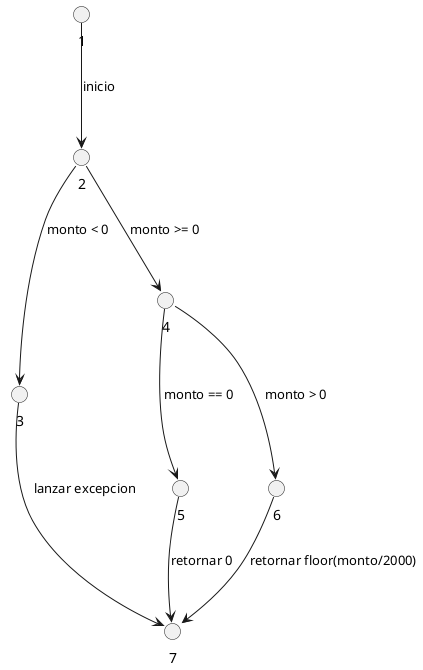

**Complejidad ciclomatica:**

- Aristas = 7, Nodos = 7
- V(G) = 7 - 7 + 2 = **3 caminos**

**Caminos independientes:**

- Camino 1: N1 -> N2 -> N3 -> N7 (monto negativo)
- Camino 2: N1 -> N2 -> N4 -> N5 -> N7 (monto cero)
- Camino 3: N1 -> N2 -> N4 -> N6 -> N7 (monto positivo)

**Casos de prueba:**

| No. Camino | ID    | Entrada        | Resultado Esperado                |
|------------|-------|----------------|-----------------------------------|
| Camino 1   | PU-01 | monto = -2.000 | Error: monto invalido             |
| Camino 2   | PU-02 | monto = 0      | almuerzos = 0                     |
| Camino 3   | PU-03 | monto = 10.000 | almuerzos = 5                     |
| Camino 3   | PU-04 | monto = 3.000  | almuerzos = 1 (fraccion ignorada) |

---

### 1.2 Módulo: Validación de Registro (RF1, RF3)

Campos con listas cerradas: Semestre (1-10), Categoria SISBEN (A1, A2, B1, B2, C1, C2, D), Trabaja (Si/No), Estudia (Si/No), Desplazado (Si/No), Funcionario Universidad (Si/No).

**Grafo de flujo:**

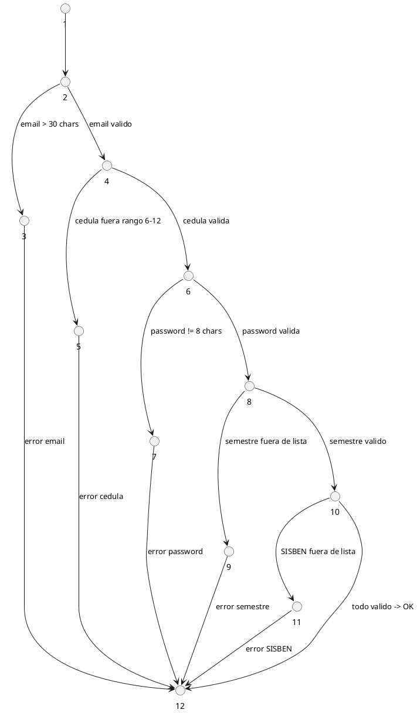

**Complejidad ciclomatica:**

- Aristas = 16, Nodos = 12
- V(G) = 16 - 12 + 2 = **6 caminos**

**Caminos independientes:**

- Camino 1: N1->N2->N3->N12
- Camino 2: N1->N2->N4->N5->N12
- Camino 3: N1->N2->N4->N6->N7->N12
- Camino 4: N1->N2->N4->N6->N8->N9->N12
- Camino 5: N1->N2->N4->N6->N8->N10->N11->N12
- Camino 6: N1->N2->N4->N6->N8->N10->N12

**Clases de equivalencia:**

| Condicion                                    | Clase Valida                   | Clase No Valida 1  | Clase No Valida 2 |
|----------------------------------------------|--------------------------------|--------------------|-------------------|
| Email (<=30 chars)                           | CV: longitud <= 30             | CI: longitud > 30  | —                 |
| Cedula (6-12 digitos)                        | CV: 6 <= long <= 12            | CI: long < 6       | CI: long > 12     |
| Password (exactamente 8)                     | CV: longitud = 8               | CI: longitud < 8   | CI: longitud > 8  |
| Semestre (lista 1-10)                        | CV: valor en [1..10]           | CI: fuera de lista | —                 |
| Categoria SISBEN                             | CV: A1, A2, B1, B2, C1, C2, D | CI: fuera de lista | —                 |
| Trabaja / Estudia / Desplazado / Funcionario | CV: Si, No                     | CI: cualquier otro | —                 |

**Casos de prueba:**

| No. Camino | ID    | Email    | Cedula     | Password | Semestre | SISBEN | Resultado Esperado       |
|------------|-------|----------|------------|----------|----------|--------|--------------------------|
| Camino 1   | PU-05 | 36 chars | 1098765432 | Abc12345 | 5        | A1     | Error: email invalido    |
| Camino 2   | PU-06 | a@b.co   | 12345      | Abc12345 | 5        | A1     | Error: cedula corta      |
| Camino 3   | PU-07 | a@b.co   | 1098765432 | abc12    | 5        | A1     | Error: password invalida |
| Camino 4   | PU-08 | a@b.co   | 1098765432 | Abc12345 | 11       | A1     | Error: semestre invalido |
| Camino 5   | PU-09 | a@b.co   | 1098765432 | Abc12345 | 5        | X9     | Error: SISBEN invalido   |
| Camino 6   | PU-10 | a@b.co   | 1098765432 | Abc12345 | 5        | A1     | Registro exitoso         |

---

### 1.3 Módulo: Comparación de Documentos SISBEN (RF4)

El estudiante adjunta tres archivos: SISBEN (PDF/JPG), horario (PDF) y cedula frontal (JPG/PNG). El sistema extrae el numero de cedula del archivo y lo compara con la cedula registrada. La validacion final la realiza el administrador con un boton en /admin/students.

**Grafo de flujo:**

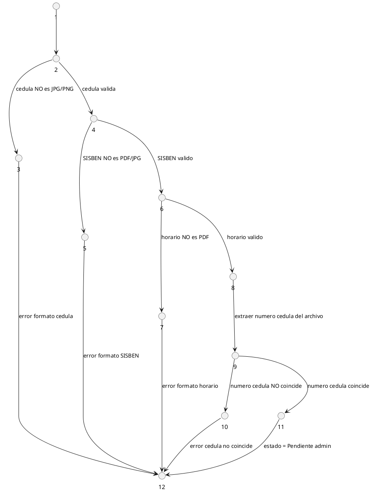

**Complejidad ciclomatica:**

- Aristas = 14, Nodos = 12
- V(G) = 14 - 12 + 2 = **5 caminos**

**Caminos independientes:**

- Camino 1: N1->N2->N3->N12
- Camino 2: N1->N2->N4->N5->N12
- Camino 3: N1->N2->N4->N6->N7->N12
- Camino 4: N1->N2->N4->N6->N8->N9->N10->N12
- Camino 5: N1->N2->N4->N6->N8->N9->N11->N12

**Clases de equivalencia:**

| Condicion              | Clase Valida                    | Clase No Valida         |
|------------------------|---------------------------------|-------------------------|
| Archivo cedula frontal | CV: JPG, PNG                    | CI: PDF, DOCX, otros    |
| Archivo SISBEN         | CV: PDF, JPG                    | CI: DOCX, PNG, otros    |
| Archivo horario        | CV: PDF                         | CI: JPG, DOCX, otros    |
| Numero cedula archivo  | CV: coincide con cedula registrada | CI: no coincide      |

**Casos de prueba:**

| No. Camino | ID    | Cedula | SISBEN | Horario | Cedula en doc | Resultado Esperado              |
|------------|-------|--------|--------|---------|---------------|---------------------------------|
| Camino 1   | PU-11 | .docx  | .pdf   | .pdf    | coincide      | Error: formato cedula invalido  |
| Camino 2   | PU-12 | .jpg   | .docx  | .pdf    | coincide      | Error: formato SISBEN invalido  |
| Camino 3   | PU-13 | .jpg   | .pdf   | .jpg    | coincide      | Error: formato horario invalido |
| Camino 4   | PU-14 | .jpg   | .pdf   | .pdf    | no coincide   | Error: cedula no coincide       |
| Camino 5   | PU-15 | .jpg   | .pdf   | .pdf    | coincide      | Estado: Pendiente admin         |

---

### 1.4 Módulo: Validación de Pago (RF9)

Admin sube recibo universidad y recibo banco. Tras pulsar Validar en /admin/payments los archivos se eliminan automaticamente. El recibo de pago no es obligatorio en el primer registro del estudiante.

**Grafo de flujo:**

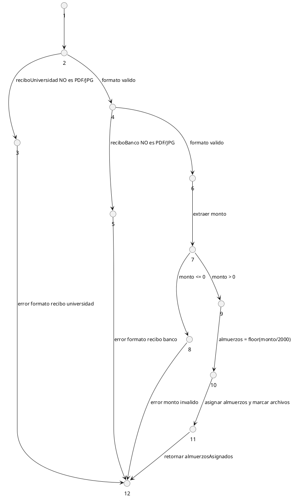

**Complejidad ciclomatica:**

- Aristas = 13, Nodos = 12
- V(G) = 13 - 12 + 2 = **4 caminos**

**Caminos independientes:**

- Camino 1: N1->N2->N3->N12
- Camino 2: N1->N2->N4->N5->N12
- Camino 3: N1->N2->N4->N6->N7->N8->N12
- Camino 4: N1->N2->N4->N6->N7->N9->N10->N11->N12

**Casos de prueba:**

| No. Camino | ID    | Recibo Universidad | Recibo Banco | Monto  | Resultado Esperado                          |
|------------|-------|--------------------|--------------|--------|---------------------------------------------|
| Camino 1   | PU-16 | .docx              | .pdf         | —      | Error: formato recibo universidad invalido  |
| Camino 2   | PU-17 | .pdf               | .docx        | —      | Error: formato recibo banco invalido        |
| Camino 3   | PU-18 | .pdf               | .pdf         | 0      | Error: monto invalido                       |
| Camino 4   | PU-19 | .pdf               | .pdf         | 20.000 | almuerzosAsignados = 10, archivos a eliminar|

---

### 1.5 Módulo: Deshabilitación Automática por Fin de Ciclo

Al llegar la fecha de fin de ciclo el sistema deshabilita todos los estudiantes activos y les solicita revalidacion de documentos para el siguiente ciclo.

**Grafo de flujo:**

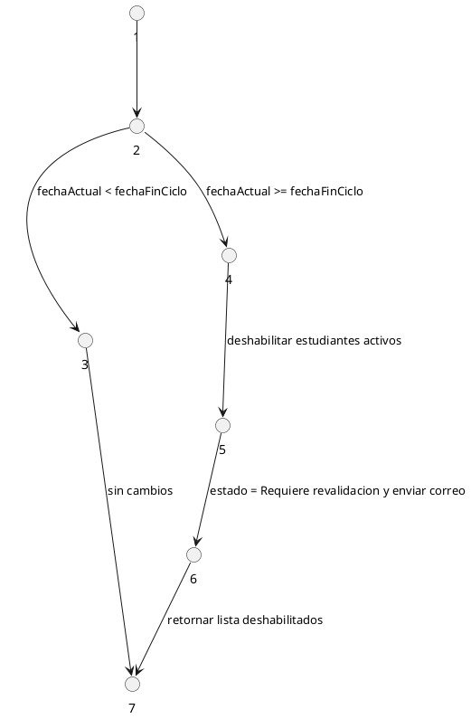

**Complejidad ciclomatica:**

- Aristas = 6, Nodos = 7
- V(G) = 6 - 7 + 2 = **2 caminos**

**Caminos independientes:**

- Camino 1: N1->N2->N3->N7
- Camino 2: N1->N2->N4->N5->N6->N7

**Casos de prueba:**

| No. Camino | ID    | fechaActual | fechaFin   | Resultado Esperado                                        |
|------------|-------|-------------|------------|-----------------------------------------------------------|
| Camino 1   | PU-20 | 2026-03-01  | 2026-06-30 | Sin cambios, estudiantes activos                          |
| Camino 2   | PU-21 | 2026-07-01  | 2026-06-30 | Deshabilitados + correos + estado = Requiere revalidacion |

---

### 1.6 Módulo: Búsqueda en Registrar Almuerzo (RF13)

Un unico buscador acepta Nombre, Apellido o UID. El historial de almuerzos no es visible para el supervisor.

**Grafo de flujo:**

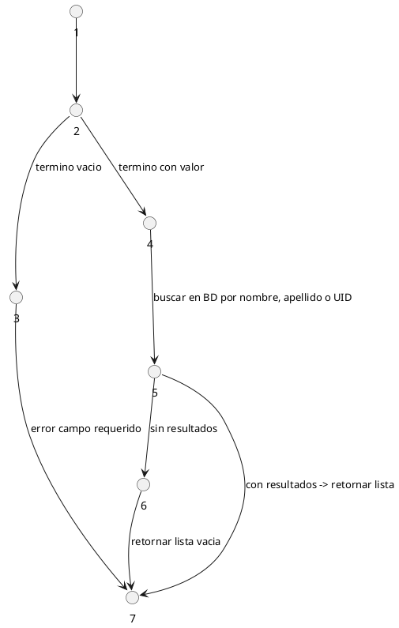

**Complejidad ciclomatica:**

- Aristas = 7, Nodos = 7
- V(G) = 7 - 7 + 2 = **3 caminos**

**Caminos independientes:**

- Camino 1: N1->N2->N3->N7
- Camino 2: N1->N2->N4->N5->N6->N7
- Camino 3: N1->N2->N4->N5->N7

**Casos de prueba:**

| No. Camino | ID    | Termino de busqueda | Resultado Esperado                   |
|------------|-------|---------------------|--------------------------------------|
| Camino 1   | PU-22 | (vacio)             | Error: campo requerido               |
| Camino 2   | PU-23 | "ZZZNOTEXISTE"      | Lista vacia: no encontrado           |
| Camino 3a  | PU-24 | "Laura" (nombre)    | Lista con estudiantes llamados Laura |
| Camino 3b  | PU-25 | "Gomez" (apellido)  | Lista con apellido Gomez             |
| Camino 3c  | PU-26 | "UID-00123" (UID)   | Perfil unico del estudiante          |

---

## 2. Pruebas de Integración

Objetivo: Verificar la comunicacion correcta entre modulos (front-end, back-end, BD, correo). Estrategia: integracion incremental ascendente (Bottom-Up). Cada hilo representa un caso de uso con su diagrama de secuencia.

---

### Estrategia Bottom-Up - Arquitectura SmartComedor

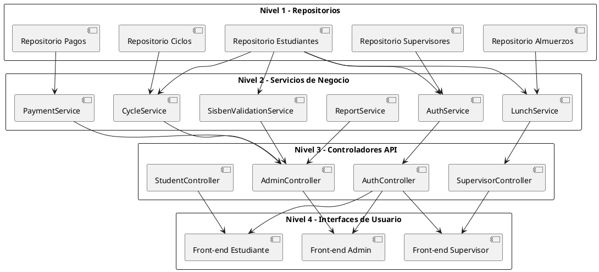

---

### 2.1 Hilo 1: Registro de Estudiante con Documentos (RF3, RF4)

| ID    | Descripcion                      | Endpoint            | Datos de entrada                                    | Resultado Esperado                   |
|-------|----------------------------------|---------------------|-----------------------------------------------------|--------------------------------------|
| PI-01 | Registro completo con documentos | POST /auth/register | Formulario + sisben.pdf + horario.pdf + cedula.jpg  | HTTP 201 + uid + estado Pendiente    |
| PI-02 | Registro sin horario             | POST /auth/register | Sin archivo horario                                 | HTTP 400 + "horario requerido"       |
| PI-03 | Cedula del documento no coincide | POST /auth/register | Cedula registrada != cedula en archivo              | HTTP 400 + "cedula no coincide"      |
| PI-04 | Registro sin recibo de pago      | POST /auth/register | Sin recibo de pago                                  | HTTP 201 (recibo no obligatorio)     |

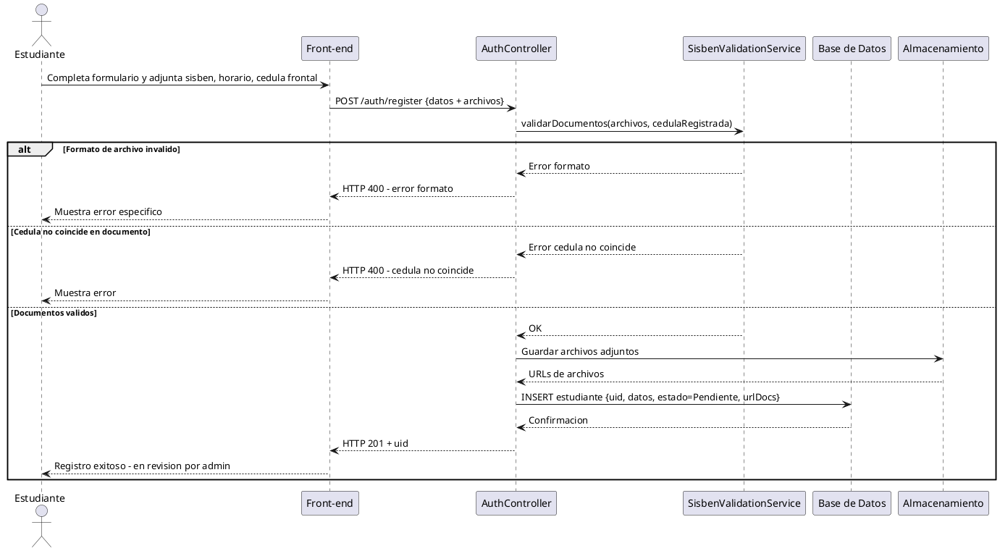

---

### 2.2 Hilo 2: Validación Manual por Administrador (RF4)

| ID    | Descripcion                           | Endpoint                            | Datos de entrada   | Resultado Esperado                         |
|-------|---------------------------------------|-------------------------------------|--------------------|--------------------------------------------|
| PI-05 | Admin visualiza documentos            | GET /admin/students/:uid/docs       | uid + token admin  | HTTP 200 + URLs de sisben, horario, cedula |
| PI-06 | Admin aprueba documentos              | PATCH /admin/students/:uid/validate | uid + token admin  | HTTP 200 + estado = Activo                 |
| PI-07 | Admin rechaza documentos              | PATCH /admin/students/:uid/reject   | uid + motivo       | HTTP 200 + estado = Rechazado + correo     |
| PI-08 | Validar estudiante sin documentos     | PATCH /admin/students/:uid/validate | uid sin documentos | HTTP 400 + "documentos incompletos"        |

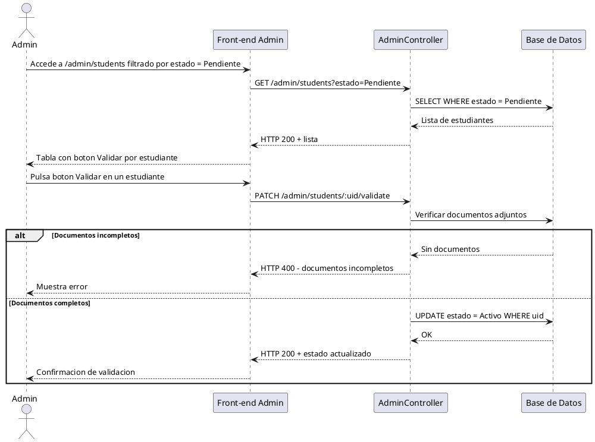

---

### 2.3 Hilo 3: Autenticación y Control de Acceso (RF1, RF2)

| ID    | Descripcion                         | Endpoint                   | Datos de entrada                            | Resultado Esperado         |
|-------|-------------------------------------|----------------------------|---------------------------------------------|----------------------------|
| PI-09 | Login correcto rol Estudiante       | POST /auth/login           | email, password, rol=Estudiante             | HTTP 200 + JWT             |
| PI-10 | Login correcto rol Admin            | POST /auth/login           | email, password, rol=Administrador          | HTTP 200 + JWT             |
| PI-11 | Login correcto rol Supervisor       | POST /auth/login           | email, password, rol=Supervisor             | HTTP 200 + JWT             |
| PI-12 | Estudiante intenta login como Admin | POST /auth/login           | credenciales estudiante + rol=Administrador | HTTP 403 + "no autorizado" |
| PI-13 | Recuperacion de contrasena          | POST /auth/forgot-password | email registrado                            | HTTP 200 + enlace enviado  |

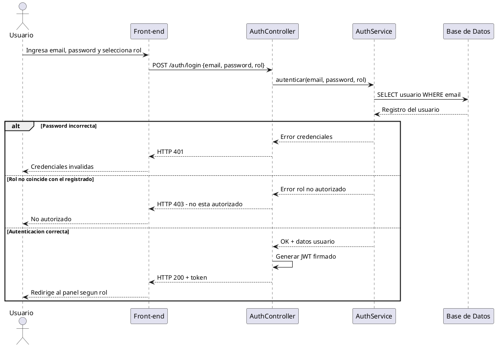

---

### 2.4 Hilo 4: Validación de Pago por Administrador (RF9)

| ID    | Descripcion                        | Endpoint                           | Datos de entrada                       | Resultado Esperado                          |
|-------|------------------------------------|------------------------------------|----------------------------------------|---------------------------------------------|
| PI-14 | Admin sube recibos y registra pago | POST /admin/payments               | uid + reciboUniversidad + reciboBanco  | HTTP 201 + almuerzosAsignados               |
| PI-15 | Admin visualiza archivos del pago  | GET /admin/payments/:id/docs       | paymentId                              | HTTP 200 + URLs ambos recibos               |
| PI-16 | Admin pulsa Validar pago           | PATCH /admin/payments/:id/validate | paymentId                              | HTTP 200 + almuerzos asignados + eliminados |
| PI-17 | Archivos eliminados tras validar   | GET /admin/payments/:id/docs       | paymentId ya validado                  | HTTP 404 + "archivos eliminados"            |
| PI-18 | Calculo: $20.000 = 10 almuerzos   | POST /admin/payments               | monto = 20.000                         | almuerzosAsignados = 10                     |
| PI-19 | Calculo: $5.000 = 2 almuerzos     | POST /admin/payments               | monto = 5.000                          | almuerzosAsignados = 2                      |

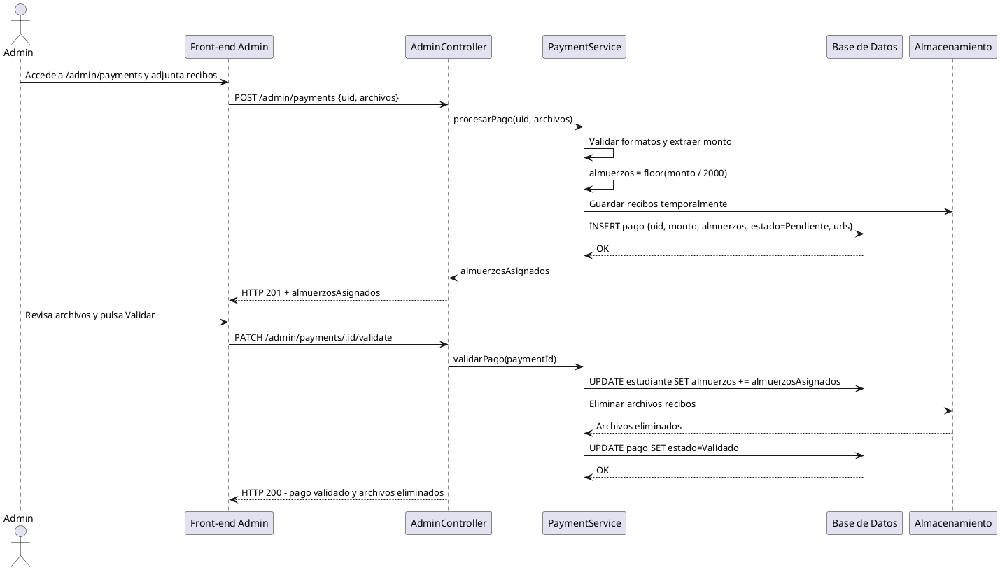

---

### 2.5 Hilo 5: Supervisor Registra Almuerzo (RF11, RF13, RF14)

| ID    | Descripcion                  | Endpoint                          | Datos de entrada         | Resultado Esperado                      |
|-------|------------------------------|-----------------------------------|--------------------------|-----------------------------------------|
| PI-20 | Busqueda por nombre          | GET /supervisor/search?q=Laura    | token supervisor         | HTTP 200 + lista {nombre, apellido, UID}|
| PI-21 | Busqueda por apellido        | GET /supervisor/search?q=Gomez    | token supervisor         | HTTP 200 + coincidencias por apellido   |
| PI-22 | Busqueda por UID             | GET /supervisor/search?q=UID-001  | token supervisor         | HTTP 200 + perfil unico                 |
| PI-23 | Busqueda sin resultados      | GET /supervisor/search?q=ZZZXXX   | token supervisor         | HTTP 200 + lista vacia                  |
| PI-24 | Registrar almuerzo           | POST /supervisor/sign             | uid + token              | HTTP 200 + almuerzos decrementados      |
| PI-25 | Firmar sin almuerzos         | POST /supervisor/sign             | uid sin almuerzos        | HTTP 400 + "sin almuerzos disponibles"  |
| PI-26 | Correo automatico al firmar  | POST /supervisor/sign             | uid valido con almuerzos | emailSent = true                        |

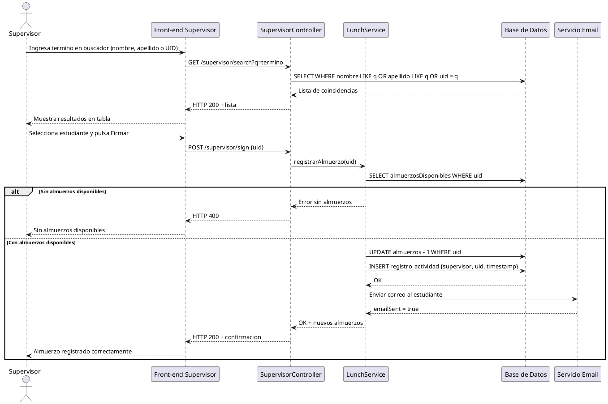

---

### 2.6 Hilo 6: Gestión de Supervisores con Teléfono (RF6)

| ID    | Descripcion                           | Endpoint                       | Datos de entrada                        | Resultado Esperado              |
|-------|---------------------------------------|--------------------------------|-----------------------------------------|---------------------------------|
| PI-27 | Admin genera enlace de invitacion     | POST /admin/invite-supervisor  | token admin                             | HTTP 200 + link con token       |
| PI-28 | Supervisor completa registro          | POST /auth/register-supervisor | nombre, email, cedula, telefono, token  | HTTP 201 + uid supervisor       |
| PI-29 | Registro supervisor sin telefono      | POST /auth/register-supervisor | sin campo telefono                      | HTTP 400 + "telefono requerido" |
| PI-30 | Admin edita telefono de supervisor    | PATCH /admin/supervisors/:uid  | uid + nuevo telefono                    | HTTP 200 + datos actualizados   |

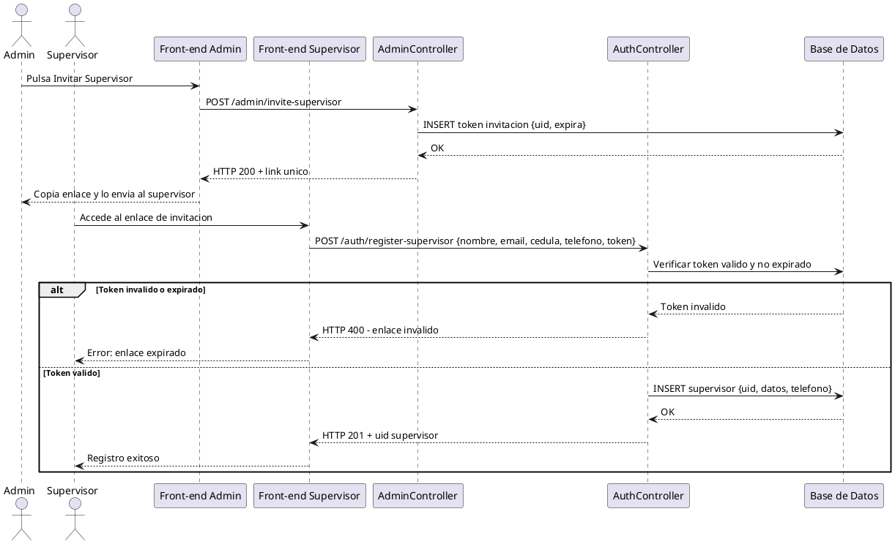

---

### 2.7 Hilo 7: Exportación de Reportes con Columnas Seleccionables (RF10)

| ID    | Descripcion                         | Endpoint                                                    | Datos de entrada | Resultado Esperado                              |
|-------|-------------------------------------|-------------------------------------------------------------|------------------|-------------------------------------------------|
| PI-31 | Exportar Excel con columnas         | GET /admin/reports?format=excel&columns=nombre,cedula,ciclo | token admin      | HTTP 200 + Excel solo con columnas seleccionadas|
| PI-32 | Exportar PDF con formato            | GET /admin/reports?format=pdf&columns=nombre,almuerzos      | token admin      | HTTP 200 + PDF con encabezado y logo            |
| PI-33 | Exportar sin columnas               | GET /admin/reports?format=excel                             | token admin      | HTTP 400 + "seleccione al menos una columna"    |
| PI-34 | Exportar con columna invalida       | GET /admin/reports?format=excel&columns=campoInventado      | token admin      | HTTP 400 + "columna no existe"                  |

---

### 2.8 Hilo 8: Gestión de Ciclos y Periodos

| ID    | Descripcion                              | Endpoint             | Datos de entrada              | Resultado Esperado                                           |
|-------|------------------------------------------|----------------------|-------------------------------|--------------------------------------------------------------|
| PI-35 | Admin crea nuevo ciclo                   | POST /admin/cycles   | nombre, fechaInicio, fechaFin | HTTP 201 + uid ciclo                                         |
| PI-36 | Admin visualiza lista de ciclos          | GET /admin/cycles    | token admin                   | HTTP 200 + lista con estado Activo/Cerrado                   |
| PI-37 | Deshabilitacion automatica al cerrar     | Proceso interno      | —                             | Estudiantes -> Requiere revalidacion + correos enviados      |
| PI-38 | Estudiante ve ciclo actual en perfil     | GET /student/profile | token estudiante              | Respuesta incluye cicloActual {nombre, fechaInicio, fechaFin}|

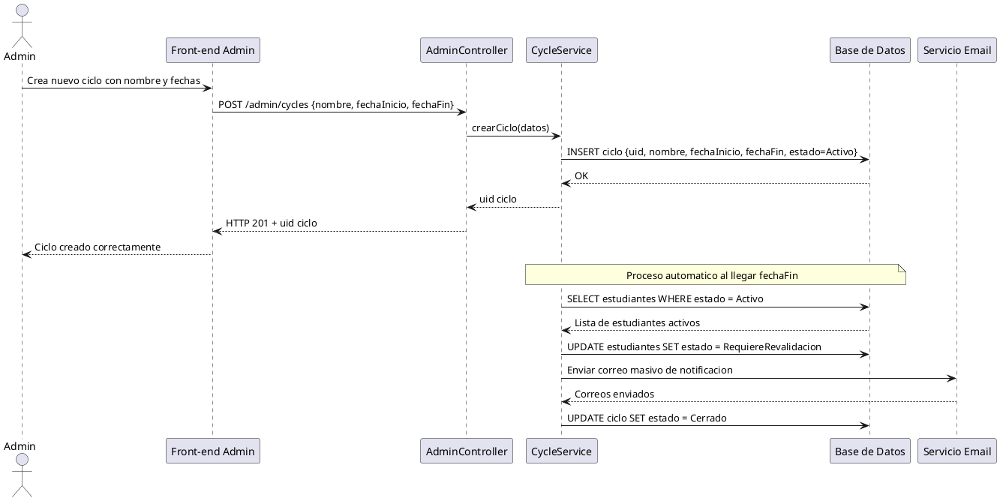

---

## 3. Pruebas de Sistema (Caja Negra)

Objetivo: Evaluar el sistema en su totalidad simulando condiciones reales de operacion. Se aplican tecnicas de caja negra. Realizadas por un equipo diferente al de desarrollo.

### 3.1 Seguridad (RNF1)

| ID    | Tipo      | Descripcion                                    | Resultado Esperado                                      |
|-------|-----------|------------------------------------------------|---------------------------------------------------------|
| PS-01 | Seguridad | Contrasena ausente en respuestas JSON          | Campo password no presente en ninguna respuesta         |
| PS-02 | Seguridad | Ruta admin sin token                           | HTTP 401 Unauthorized                                   |
| PS-03 | Seguridad | Token JWT manipulado                           | HTTP 403 Forbidden                                      |
| PS-04 | Seguridad | Token de Estudiante en ruta Admin              | HTTP 403 Forbidden                                      |
| PS-05 | Seguridad | Archivos recibos eliminados post-validacion    | GET /admin/payments/:id/docs retorna HTTP 404           |
| PS-06 | Seguridad | Documentos SISBEN no accesibles por Estudiante | Estudiante no puede ver documentos ajenos               |

### 3.2 Rendimiento (RNF3)

| ID    | Tipo        | Descripcion              | Condicion                       | Resultado Esperado               |
|-------|-------------|--------------------------|---------------------------------|----------------------------------|
| PS-07 | Rendimiento | Busqueda supervisor      | GET /supervisor/search?q=X      | Respuesta < 3.000 ms             |
| PS-08 | Rendimiento | Generacion reporte Excel | GET /admin/reports?format=excel | Respuesta < 5.000 ms             |
| PS-09 | Carga       | Login simultaneo         | 50 peticiones concurrentes      | Sin errores, promedio < 2.000 ms |
| PS-10 | Estres      | Carga masiva de Excel    | Archivo con 500 estudiantes     | Procesado sin errores en < 30 s  |

### 3.3 Funcionalidades Transversales

| ID    | Req.     | Descripcion                               | Resultado Esperado                          |
|-------|----------|-------------------------------------------|---------------------------------------------|
| PS-11 | RF5      | Queja anonima sin autenticacion           | HTTP 201 + queja almacenada                 |
| PS-12 | RF10     | Reporte Excel con columnas seleccionadas  | Solo columnas indicadas en el archivo       |
| PS-13 | RF10     | Reporte PDF con formato institucional     | Encabezado, logo y estructura definida      |
| PS-14 | RF18     | Calificacion = 6 (fuera de rango)         | HTTP 400 Bad Request                        |
| PS-15 | RF18     | Calificacion = 4 (valido)                 | HTTP 200 OK                                 |
| PS-16 | RF-ciclo | Deshabilitacion automatica al vencer ciclo| Estudiantes deshabilitados + notificaciones |
| PS-17 | RF-uid   | Todas las entidades tienen UID unico      | Ningun UID repetido en ninguna entidad      |

**Clases de equivalencia - Calificacion del servicio (RF18):**

| Condicion       | Clase Valida            | Clase No Valida 1 | Clase No Valida 2 |
|-----------------|-------------------------|--------------------|-------------------|
| Estrellas (1-5) | CV: 1 <= estrellas <= 5 | CI: estrellas < 1  | CI: estrellas > 5 |

---

## 4. Pruebas de Aceptación

Objetivo: Validar que el sistema satisface los criterios de aceptacion desde la perspectiva de cada rol. Participacion activa del usuario en la ejecucion de los casos.

### 4.1 Rol: Estudiante

| ID    | Req.     | Flujo a Validar                           | Criterio de Aceptacion                                            |
|-------|----------|-------------------------------------------|-------------------------------------------------------------------|
| PA-01 | RF16     | Ver perfil propio                         | Muestra nombre, carrera, semestre, almuerzos y ciclo actual       |
| PA-02 | RF17     | Primer registro sin recibo de pago        | Estudiante completa registro sin subir recibo                     |
| PA-03 | RF3      | Adjuntar SISBEN, horario y cedula frontal | Los tres archivos se cargan y estado queda en Pendiente           |
| PA-04 | RF3      | Seleccionar semestre y SISBEN de lista    | Solo permite valores de la lista, sin entrada libre               |
| PA-05 | RF18     | Calificar servicio del comedor            | Registra calificacion 1-5 con comentario opcional                 |
| PA-06 | RF19     | Ver noticias del comedor                  | Muestra publicaciones del ciclo actual                            |
| PA-07 | RF5      | Consultar asistente virtual               | El chatbot responde consultas frecuentes                          |
| PA-08 | RF-ciclo | Notificacion al vencer ciclo              | Correo indica que debe revalidar documentos                       |

### 4.2 Rol: Administrador

| ID    | Req.     | Flujo a Validar                        | Criterio de Aceptacion                                             |
|-------|----------|----------------------------------------|--------------------------------------------------------------------|
| PA-09 | RF4      | Validar documentos en /admin/students  | Validar cambia estado a Activo; Rechazar envia correo              |
| PA-10 | RF9      | Validar pago en /admin/payments        | Boton Validar asigna almuerzos y elimina archivos adjuntos         |
| PA-11 | RF9      | Ver archivos del recibo antes de validar| Puede ver ambos recibos antes de pulsar Validar                   |
| PA-12 | RF8      | Habilitar o deshabilitar estudiante    | Cambio de estado se refleja en tiempo real                         |
| PA-13 | RF10     | Seleccionar columnas al exportar       | Exporta solo columnas marcadas en Excel y PDF con formato          |
| PA-14 | RF-ciclo | Crear ciclo con fechas                 | Sistema muestra el ciclo y programa deshabilitacion automatica     |
| PA-15 | RF-ciclo | Ver lista de ciclos (periodos)         | Tabla con ciclos pasados, activo y futuros con su estado           |
| PA-16 | RF6      | Gestionar supervisores con telefono    | Al crear o editar supervisor se guarda el numero de telefono       |

### 4.3 Rol: Supervisor

| ID    | Req. | Flujo a Validar                         | Criterio de Aceptacion                                        |
|-------|------|-----------------------------------------|---------------------------------------------------------------|
| PA-17 | RF11 | Buscar con un solo buscador             | Acepta nombre, apellido o UID y retorna coincidencias         |
| PA-18 | RF12 | Ver informacion completa del estudiante | Muestra foto, datos, dias autorizados y almuerzos disponibles |
| PA-19 | RF13 | Firmar almuerzo                         | Almuerzos disponibles se decrementan en 1                     |
| PA-20 | RF14 | Correo automatico al estudiante         | Estudiante recibe notificacion tras el registro               |
| PA-21 | RF15 | Historial no visible para supervisor    | La vista del supervisor no muestra historial de almuerzos     |

**Flujo completo de aceptacion - Supervisor:**

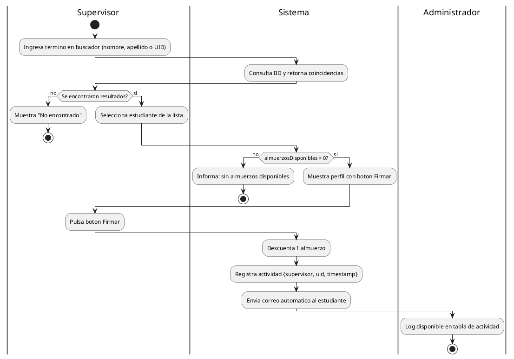

---

## Trazabilidad de Requisitos

| Requisito              | PU (Unitaria) | PI (Integracion) | PS (Sistema)        | PA (Aceptacion)     |
| ---------------------- | ------------- | ---------------- | ------------------- | ------------------- |
| RF1 - Autenticacion    | PU-05 a PU-10 | PI-09 a PI-13    | PS-02, PS-03, PS-04 | —                   |
| RF2 - Recuperacion     | —             | PI-13            | —                   | —                   |
| RF3 - Registro + docs  | PU-05 a PU-15 | PI-01 a PI-04    | —                   | PA-02, PA-03, PA-04 |
| RF4 - SISBEN manual    | PU-11 a PU-15 | PI-05 a PI-08    | —                   | PA-09               |
| RF5 - Asistente        | —             | —                | PS-11               | PA-07               |
| RF6 - Supervisores     | —             | PI-27 a PI-30    | —                   | PA-16               |
| RF8 - Habilitar        | —             | —                | —                   | PA-12               |
| RF9 - Pagos            | PU-16 a PU-19 | PI-14 a PI-19    | PS-05               | PA-10, PA-11        |
| RF10 - Reportes        | —             | PI-31 a PI-34    | PS-12, PS-13        | PA-13               |
| RF11 - Buscar          | PU-22 a PU-26 | PI-20 a PI-23    | —                   | PA-17               |
| RF12 - Ver datos       | —             | —                | —                   | PA-18               |
| RF13 - Firmar          | —             | PI-24, PI-25     | —                   | PA-19               |
| RF14 - Correo auto     | —             | PI-26            | —                   | PA-20               |
| RF15 - Log Admin       | —             | —                | —                   | PA-21               |
| RF16 - Perfil          | —             | —                | —                   | PA-01               |
| RF17 - Recibo opcional | —             | PI-04            | —                   | PA-02               |
| RF18 - Calificar       | —             | —                | PS-14, PS-15        | PA-05               |
| RF19 - Noticias        | —             | —                | —                   | PA-06               |
| RF-ciclo - Periodos    | PU-20, PU-21  | PI-35 a PI-38    | PS-16               | PA-08, PA-14, PA-15 |
| RF-uid - UID global    | —             | —                | PS-17               | —                   |
| RNF1 - Seguridad       | —             | —                | PS-01 a PS-06       | —                   |
| RNF3 - Rendimiento     | —             | —                | PS-07 a PS-10       | —                   |